# Protocol Sequence Diagrams and Flows

This document provides comprehensive sequence diagrams illustrating all critical protocol flows and interactions, showing message exchanges, state transitions, and timing relationships between peers during various protocol operations.

## Overview

The sequence diagrams demonstrate the dynamic behavior of the protocol by visualizing the message flows, timing dependencies, and state coordination that occur during connection establishment, data transmission, recovery scenarios, and connection termination. These diagrams serve as essential implementation guides and debugging aids.

## Purpose and Rationale

Sequence diagrams serve essential documentation and implementation functions:

- **Flow Visualization**: Provides clear visual representation of complex protocol interactions and message sequences
- **Implementation Guidance**: Helps developers understand the correct order and timing of protocol operations
- **Debugging Aid**: Enables troubleshooting by showing expected message flows versus actual behavior
- **Protocol Validation**: Allows verification that implementations follow the correct sequence of operations
- **Edge Case Documentation**: Illustrates how the protocol handles various error conditions and recovery scenarios
- **Integration Testing**: Provides test scenarios for validating protocol implementation correctness

The diagrams complement the technical specifications by showing the dynamic behavior and interactions that emerge from the static protocol definitions.

## 1. Connection Establishment Flows

### 1.1 Basic Connection Establishment (No PSK Discovery)

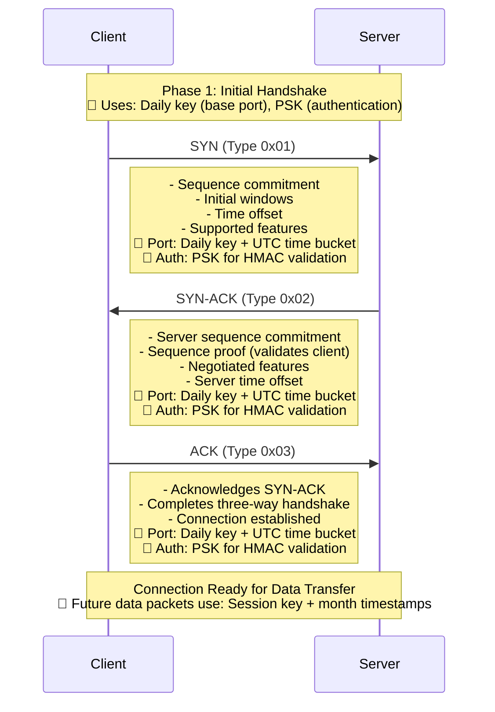
```mermaid
sequenceDiagram
    participant Client
    participant Server
    
    Note over Client,Server: Phase 1: Initial Handshake<br/>🔑 Uses: Daily key (base port), PSK (authentication)
    Client->>Server: SYN (Type 0x01)
    Note right of Client: - Sequence commitment<br/>- Initial windows<br/>- Time offset<br/>- Supported features<br/>🔑 Port: Daily key + UTC time bucket<br/>🔑 Auth: PSK for HMAC validation
    
    Server->>Client: SYN-ACK (Type 0x02)
    Note left of Server: - Server sequence commitment<br/>- Sequence proof (validates client)<br/>- Negotiated features<br/>- Server time offset<br/>🔑 Port: Daily key + UTC time bucket<br/>🔑 Auth: PSK for HMAC validation
    
    Client->>Server: ACK (Type 0x03)
    Note right of Client: - Acknowledges SYN-ACK<br/>- Completes three-way handshake<br/>- Connection established<br/>🔑 Port: Daily key + UTC time bucket<br/>🔑 Auth: PSK for HMAC validation
    
    Note over Client,Server: Connection Ready for Data Transfer<br/>🔑 Future data packets use: Session key + month timestamps
```

### 1.2 Connection Establishment with PSK Discovery

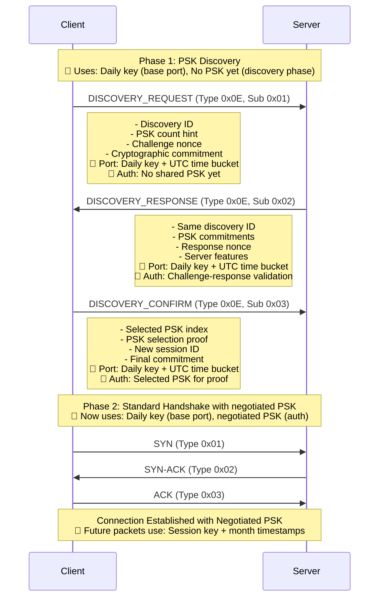
```mermaid
sequenceDiagram
    participant Client
    participant Server
    
    Note over Client,Server: Phase 1: PSK Discovery<br/>🔑 Uses: Daily key (base port), No PSK yet (discovery phase)
    Client->>Server: DISCOVERY_REQUEST (Type 0x0E, Sub 0x01)
    Note right of Client: - Discovery ID<br/>- PSK count hint<br/>- Challenge nonce<br/>- Cryptographic commitment<br/>🔑 Port: Daily key + UTC time bucket<br/>🔑 Auth: No shared PSK yet
    
    Server->>Client: DISCOVERY_RESPONSE (Type 0x0E, Sub 0x02)
    Note left of Server: - Same discovery ID<br/>- PSK commitments<br/>- Response nonce<br/>- Server features<br/>🔑 Port: Daily key + UTC time bucket<br/>🔑 Auth: Challenge-response validation
    
    Client->>Server: DISCOVERY_CONFIRM (Type 0x0E, Sub 0x03)
    Note right of Client: - Selected PSK index<br/>- PSK selection proof<br/>- New session ID<br/>- Final commitment<br/>🔑 Port: Daily key + UTC time bucket<br/>🔑 Auth: Selected PSK for proof
    
    Note over Client,Server: Phase 2: Standard Handshake with negotiated PSK<br/>🔑 Now uses: Daily key (base port), negotiated PSK (auth)
    Client->>Server: SYN (Type 0x01)
    Server->>Client: SYN-ACK (Type 0x02)
    Client->>Server: ACK (Type 0x03)
    
    Note over Client,Server: Connection Established with Negotiated PSK<br/>🔑 Future packets use: Session key + month timestamps
```

### 1.3 Connection Establishment with ECDH Key Exchange

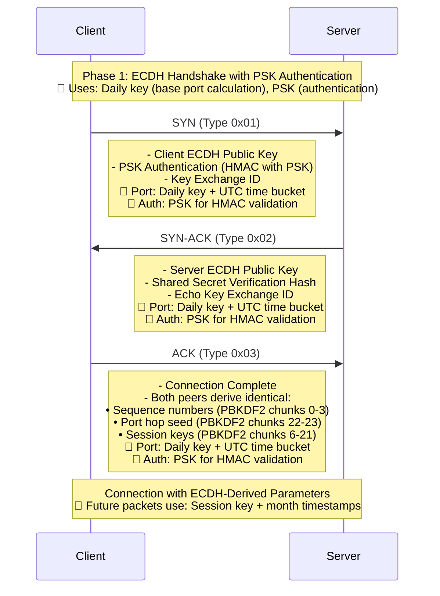
```mermaid
sequenceDiagram
    participant Client
    participant Server
    
    Note over Client,Server: Phase 1: ECDH Handshake with PSK Authentication<br/>🔑 Uses: Daily key (base port calculation), PSK (authentication)
    Client->>Server: SYN (Type 0x01)
    Note right of Client: - Client ECDH Public Key<br/>- PSK Authentication (HMAC with PSK)<br/>- Key Exchange ID<br/>🔑 Port: Daily key + UTC time bucket<br/>🔑 Auth: PSK for HMAC validation
    
    Server->>Client: SYN-ACK (Type 0x02)
    Note left of Server: - Server ECDH Public Key<br/>- Shared Secret Verification Hash<br/>- Echo Key Exchange ID<br/>🔑 Port: Daily key + UTC time bucket<br/>🔑 Auth: PSK for HMAC validation
    
    Client->>Server: ACK (Type 0x03)
    Note right of Client: - Connection Complete<br/>- Both peers derive identical:<br/>  • Sequence numbers (PBKDF2 chunks 0-3)<br/>  • Port hop seed (PBKDF2 chunks 22-23)<br/>  • Session keys (PBKDF2 chunks 6-21)<br/>🔑 Port: Daily key + UTC time bucket<br/>🔑 Auth: PSK for HMAC validation
    
    Note over Client,Server: Connection with ECDH-Derived Parameters<br/>🔑 Future packets use: Session key + month timestamps
```

### 1.4 Privacy-Preserving PSK Discovery

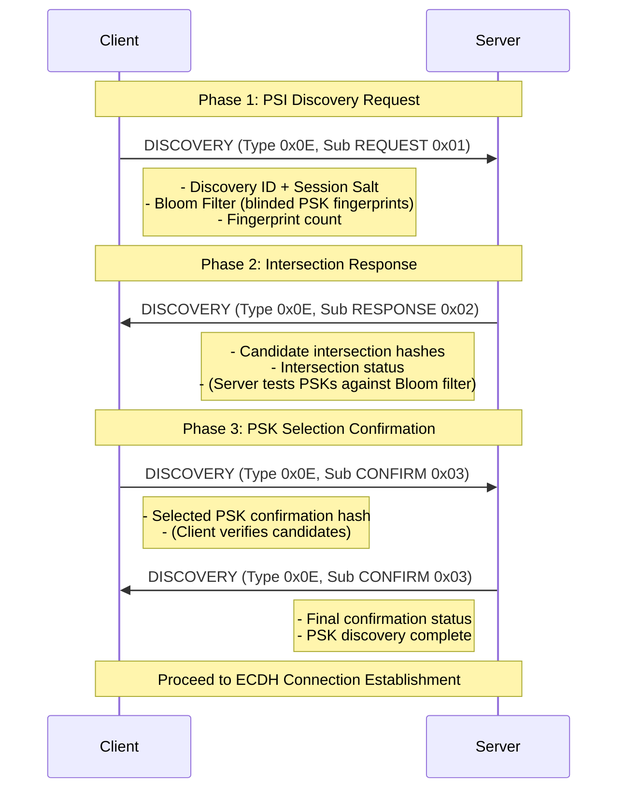
```mermaid
sequenceDiagram
    participant Client
    participant Server
    
    Note over Client,Server: Phase 1: PSI Discovery Request
    Client->>Server: DISCOVERY (Type 0x0E, Sub REQUEST 0x01)
    Note right of Client: - Discovery ID + Session Salt<br/>- Bloom Filter (blinded PSK fingerprints)<br/>- Fingerprint count
    
    Note over Client,Server: Phase 2: Intersection Response
    Server->>Client: DISCOVERY (Type 0x0E, Sub RESPONSE 0x02)
    Note left of Server: - Candidate intersection hashes<br/>- Intersection status<br/>- (Server tests PSKs against Bloom filter)
    
    Note over Client,Server: Phase 3: PSK Selection Confirmation
    Client->>Server: DISCOVERY (Type 0x0E, Sub CONFIRM 0x03)
    Note right of Client: - Selected PSK confirmation hash<br/>- (Client verifies candidates)
    
    Server->>Client: DISCOVERY (Type 0x0E, Sub CONFIRM 0x03)
    Note left of Server: - Final confirmation status<br/>- PSK discovery complete
    
    Note over Client,Server: Proceed to ECDH Connection Establishment
```

## 2. Data Transmission Flows

### 2.1 Normal Data Transmission with Flow Control

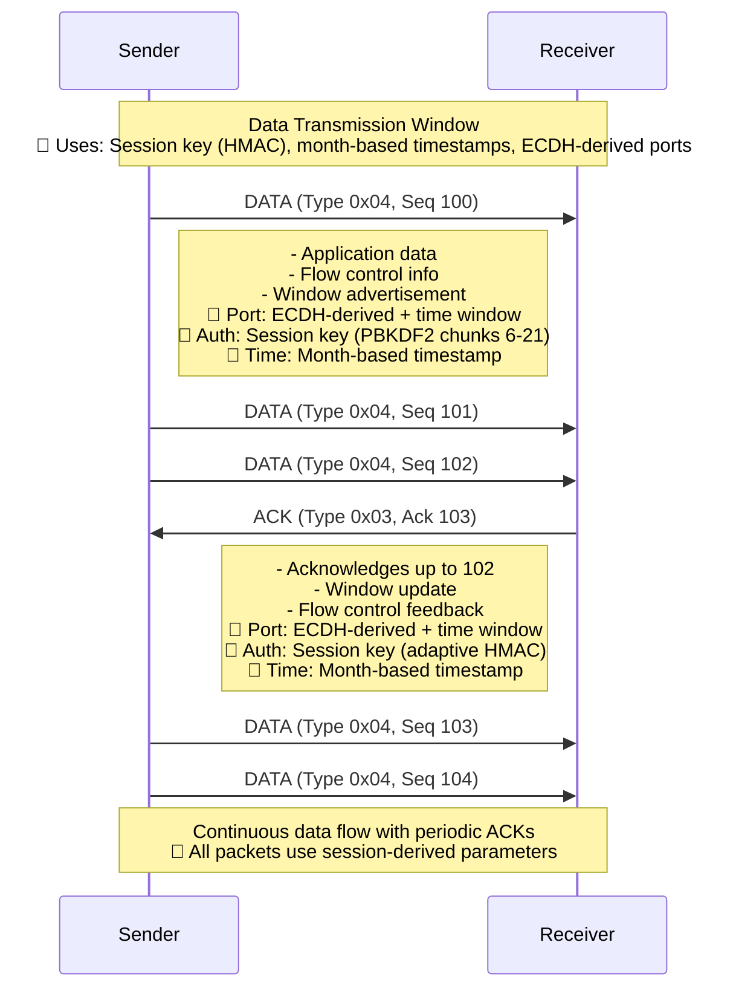
```mermaid
sequenceDiagram
    participant Sender
    participant Receiver
    
    Note over Sender,Receiver: Data Transmission Window<br/>🔑 Uses: Session key (HMAC), month-based timestamps, ECDH-derived ports
    Sender->>Receiver: DATA (Type 0x04, Seq 100)
    Note right of Sender: - Application data<br/>- Flow control info<br/>- Window advertisement<br/>🔑 Port: ECDH-derived + time window<br/>🔑 Auth: Session key (PBKDF2 chunks 6-21)<br/>🔑 Time: Month-based timestamp
    
    Sender->>Receiver: DATA (Type 0x04, Seq 101)
    Sender->>Receiver: DATA (Type 0x04, Seq 102)
    
    Receiver->>Sender: ACK (Type 0x03, Ack 103)
    Note left of Receiver: - Acknowledges up to 102<br/>- Window update<br/>- Flow control feedback<br/>🔑 Port: ECDH-derived + time window<br/>🔑 Auth: Session key (adaptive HMAC)<br/>🔑 Time: Month-based timestamp
    
    Sender->>Receiver: DATA (Type 0x04, Seq 103)
    Sender->>Receiver: DATA (Type 0x04, Seq 104)
    
    Note over Sender,Receiver: Continuous data flow with periodic ACKs<br/>🔑 All packets use session-derived parameters
```

### 2.2 Data Transmission with Packet Loss and SACK

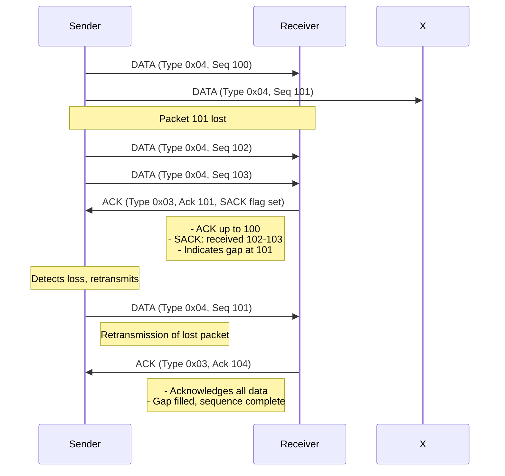
```mermaid
sequenceDiagram
    participant Sender
    participant Receiver
    
    Sender->>Receiver: DATA (Type 0x04, Seq 100)
    Sender->>X: DATA (Type 0x04, Seq 101)
    Note over Sender,Receiver: Packet 101 lost
    Sender->>Receiver: DATA (Type 0x04, Seq 102)
    Sender->>Receiver: DATA (Type 0x04, Seq 103)
    
    Receiver->>Sender: ACK (Type 0x03, Ack 101, SACK flag set)
    Note left of Receiver: - ACK up to 100<br/>- SACK: received 102-103<br/>- Indicates gap at 101
    
    Note over Sender: Detects loss, retransmits
    Sender->>Receiver: DATA (Type 0x04, Seq 101)
    Note right of Sender: Retransmission of lost packet
    
    Receiver->>Sender: ACK (Type 0x03, Ack 104)
    Note left of Receiver: - Acknowledges all data<br/>- Gap filled, sequence complete
```

### 2.3 Large Data with Fragmentation

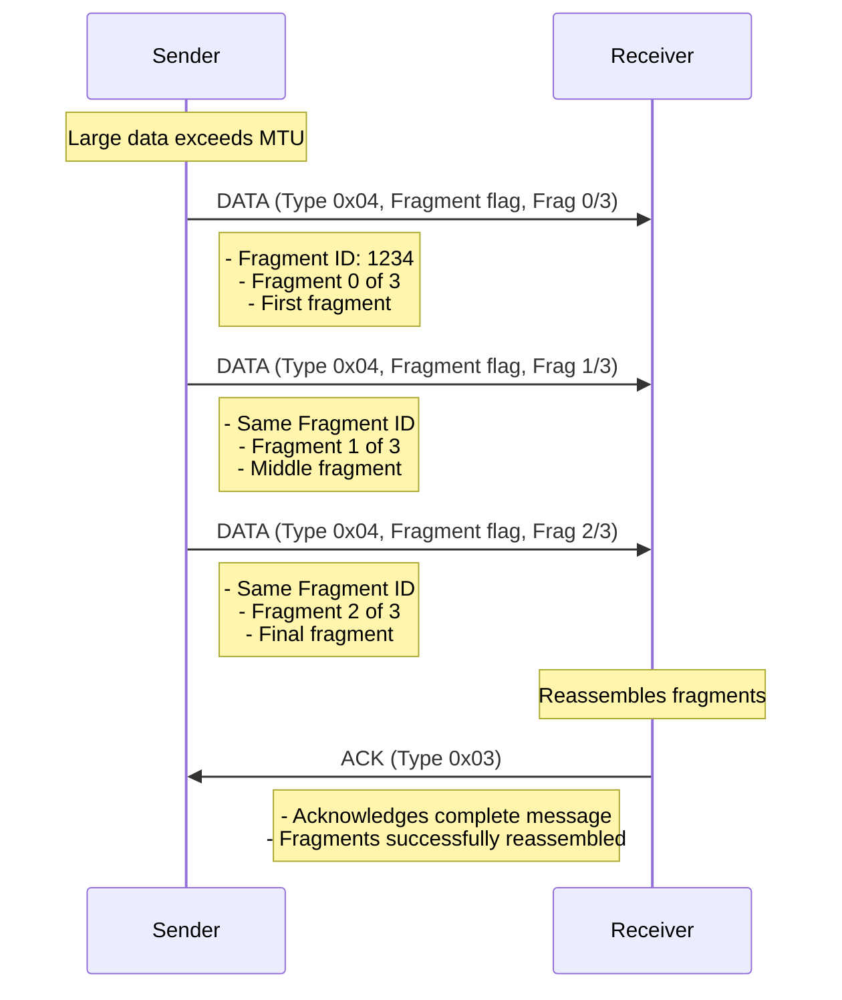
```mermaid
sequenceDiagram
    participant Sender
    participant Receiver
    
    Note over Sender: Large data exceeds MTU
    Sender->>Receiver: DATA (Type 0x04, Fragment flag, Frag 0/3)
    Note right of Sender: - Fragment ID: 1234<br/>- Fragment 0 of 3<br/>- First fragment
    
    Sender->>Receiver: DATA (Type 0x04, Fragment flag, Frag 1/3)
    Note right of Sender: - Same Fragment ID<br/>- Fragment 1 of 3<br/>- Middle fragment
    
    Sender->>Receiver: DATA (Type 0x04, Fragment flag, Frag 2/3)
    Note right of Sender: - Same Fragment ID<br/>- Fragment 2 of 3<br/>- Final fragment
    
    Note over Receiver: Reassembles fragments
    Receiver->>Sender: ACK (Type 0x03)
    Note left of Receiver: - Acknowledges complete message<br/>- Fragments successfully reassembled
```

## 3. Port Hopping and Time Synchronization

### 3.1 Normal Port Hopping Operation

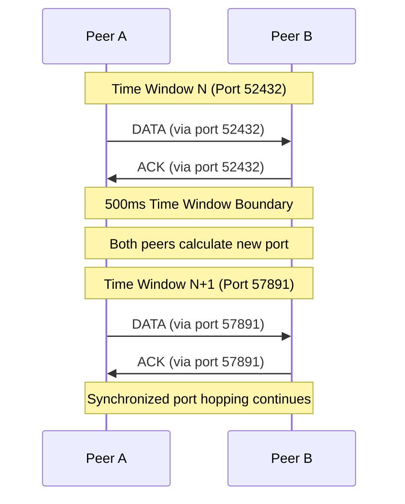
```mermaid
sequenceDiagram
    participant Peer A
    participant Peer B
    
    Note over Peer A,Peer B: Time Window N (Port 52432)
    Peer A->>Peer B: DATA (via port 52432)
    Peer B->>Peer A: ACK (via port 52432)
    
    Note over Peer A,Peer B: 500ms Time Window Boundary
    Note over Peer A,Peer B: Both peers calculate new port
    Note over Peer A,Peer B: Time Window N+1 (Port 57891)
    
    Peer A->>Peer B: DATA (via port 57891)
    Peer B->>Peer A: ACK (via port 57891)
    
    Note over Peer A,Peer B: Synchronized port hopping continues
```

### 3.2 Time Synchronization Exchange

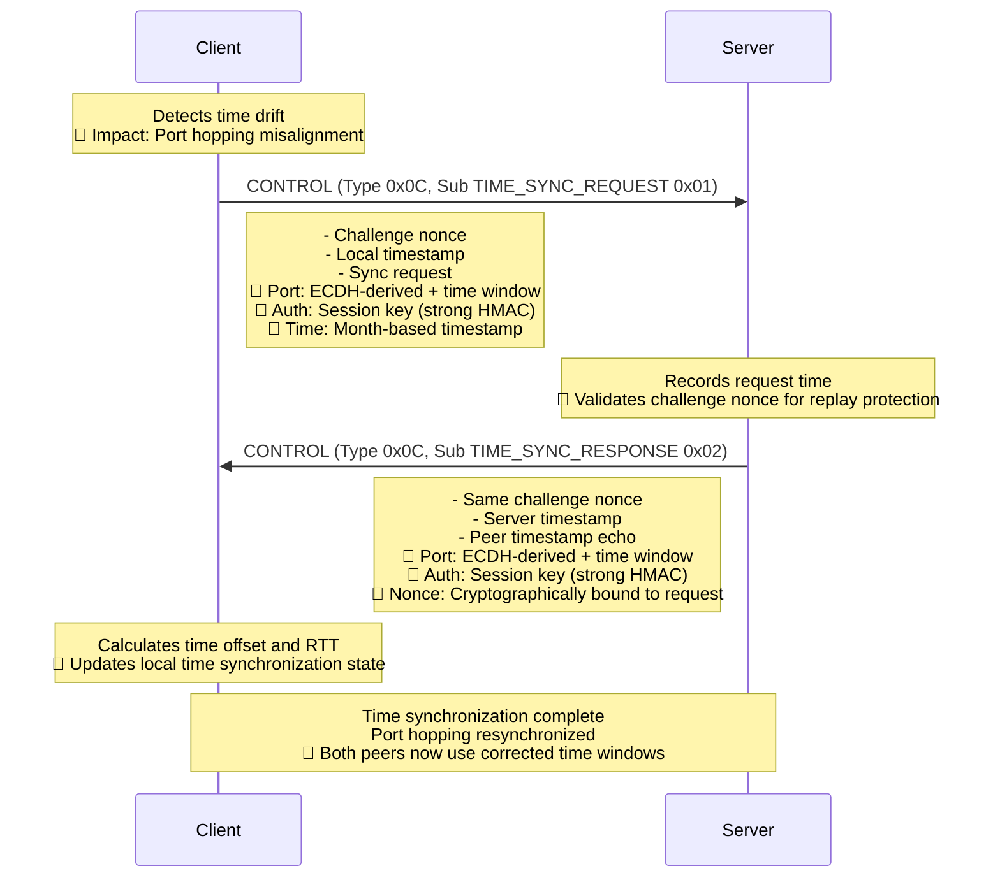
```mermaid
sequenceDiagram
    participant Client
    participant Server
    
    Note over Client: Detects time drift<br/>🔑 Impact: Port hopping misalignment
    Client->>Server: CONTROL (Type 0x0C, Sub TIME_SYNC_REQUEST 0x01)
    Note right of Client: - Challenge nonce<br/>- Local timestamp<br/>- Sync request<br/>🔑 Port: ECDH-derived + time window<br/>🔑 Auth: Session key (strong HMAC)<br/>🔑 Time: Month-based timestamp
    
    Note over Server: Records request time<br/>🔑 Validates challenge nonce for replay protection
    Server->>Client: CONTROL (Type 0x0C, Sub TIME_SYNC_RESPONSE 0x02)
    Note left of Server: - Same challenge nonce<br/>- Server timestamp<br/>- Peer timestamp echo<br/>🔑 Port: ECDH-derived + time window<br/>🔑 Auth: Session key (strong HMAC)<br/>🔑 Nonce: Cryptographically bound to request
    
    Note over Client: Calculates time offset and RTT<br/>🔑 Updates local time synchronization state
    Note over Client,Server: Time synchronization complete<br/>Port hopping resynchronized<br/>🔑 Both peers now use corrected time windows
```

## 4. Recovery Scenarios

### 4.1 Time Resynchronization Recovery

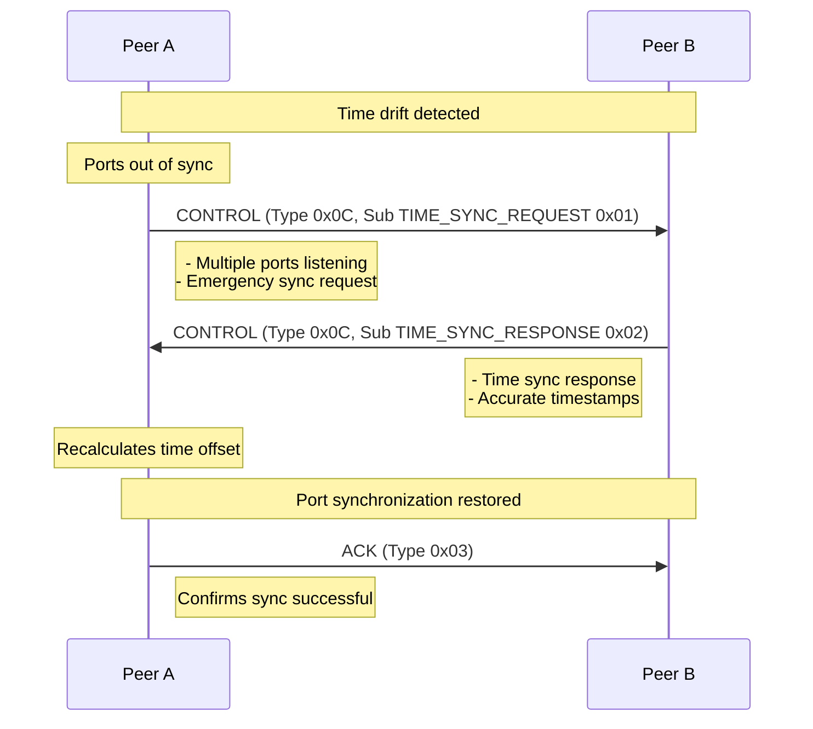
```mermaid
sequenceDiagram
    participant Peer A
    participant Peer B
    
    Note over Peer A,Peer B: Time drift detected
    Note over Peer A: Ports out of sync
    
    Peer A->>Peer B: CONTROL (Type 0x0C, Sub TIME_SYNC_REQUEST 0x01)
    Note right of Peer A: - Multiple ports listening<br/>- Emergency sync request
    
    Peer B->>Peer A: CONTROL (Type 0x0C, Sub TIME_SYNC_RESPONSE 0x02)
    Note left of Peer B: - Time sync response<br/>- Accurate timestamps
    
    Note over Peer A: Recalculates time offset
    Note over Peer A,Peer B: Port synchronization restored
    
    Peer A->>Peer B: ACK (Type 0x03)
    Note right of Peer A: Confirms sync successful
```

### 4.2 Sequence Repair Recovery

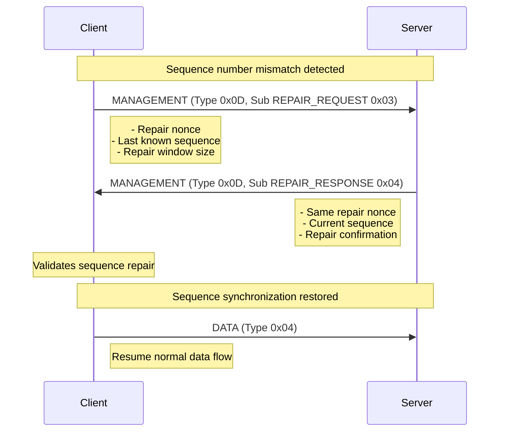
```mermaid
sequenceDiagram
    participant Client
    participant Server
    
    Note over Client,Server: Sequence number mismatch detected
    
    Client->>Server: MANAGEMENT (Type 0x0D, Sub REPAIR_REQUEST 0x03)
    Note right of Client: - Repair nonce<br/>- Last known sequence<br/>- Repair window size
    
    Server->>Client: MANAGEMENT (Type 0x0D, Sub REPAIR_RESPONSE 0x04)
    Note left of Server: - Same repair nonce<br/>- Current sequence<br/>- Repair confirmation
    
    Note over Client: Validates sequence repair
    Note over Client,Server: Sequence synchronization restored
    
    Client->>Server: DATA (Type 0x04)
    Note right of Client: Resume normal data flow
```

### 4.3 ECDH-Based Session Rekeying

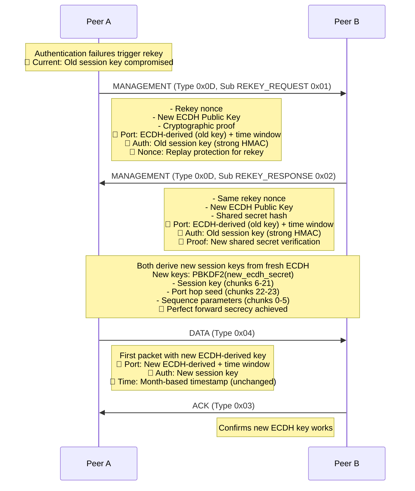
```mermaid
sequenceDiagram
    participant Peer A
    participant Peer B
    
    Note over Peer A: Authentication failures trigger rekey<br/>🔑 Current: Old session key compromised
    
    Peer A->>Peer B: MANAGEMENT (Type 0x0D, Sub REKEY_REQUEST 0x01)
    Note right of Peer A: - Rekey nonce<br/>- New ECDH Public Key<br/>- Cryptographic proof<br/>🔑 Port: ECDH-derived (old key) + time window<br/>🔑 Auth: Old session key (strong HMAC)<br/>🔑 Nonce: Replay protection for rekey
    
    Peer B->>Peer A: MANAGEMENT (Type 0x0D, Sub REKEY_RESPONSE 0x02)
    Note left of Peer B: - Same rekey nonce<br/>- New ECDH Public Key<br/>- Shared secret hash<br/>🔑 Port: ECDH-derived (old key) + time window<br/>🔑 Auth: Old session key (strong HMAC)<br/>🔑 Proof: New shared secret verification
    
    Note over Peer A,Peer B: Both derive new session keys from fresh ECDH<br/>New keys: PBKDF2(new_ecdh_secret)<br/>- Session key (chunks 6-21)<br/>- Port hop seed (chunks 22-23)<br/>- Sequence parameters (chunks 0-5)<br/>🔑 Perfect forward secrecy achieved
    
    Peer A->>Peer B: DATA (Type 0x04)
    Note right of Peer A: First packet with new ECDH-derived key<br/>🔑 Port: New ECDH-derived + time window<br/>🔑 Auth: New session key<br/>🔑 Time: Month-based timestamp (unchanged)
    
    Peer B->>Peer A: ACK (Type 0x03)
    Note left of Peer B: Confirms new ECDH key works
```

### 4.4 Connection Termination on Recovery Failure

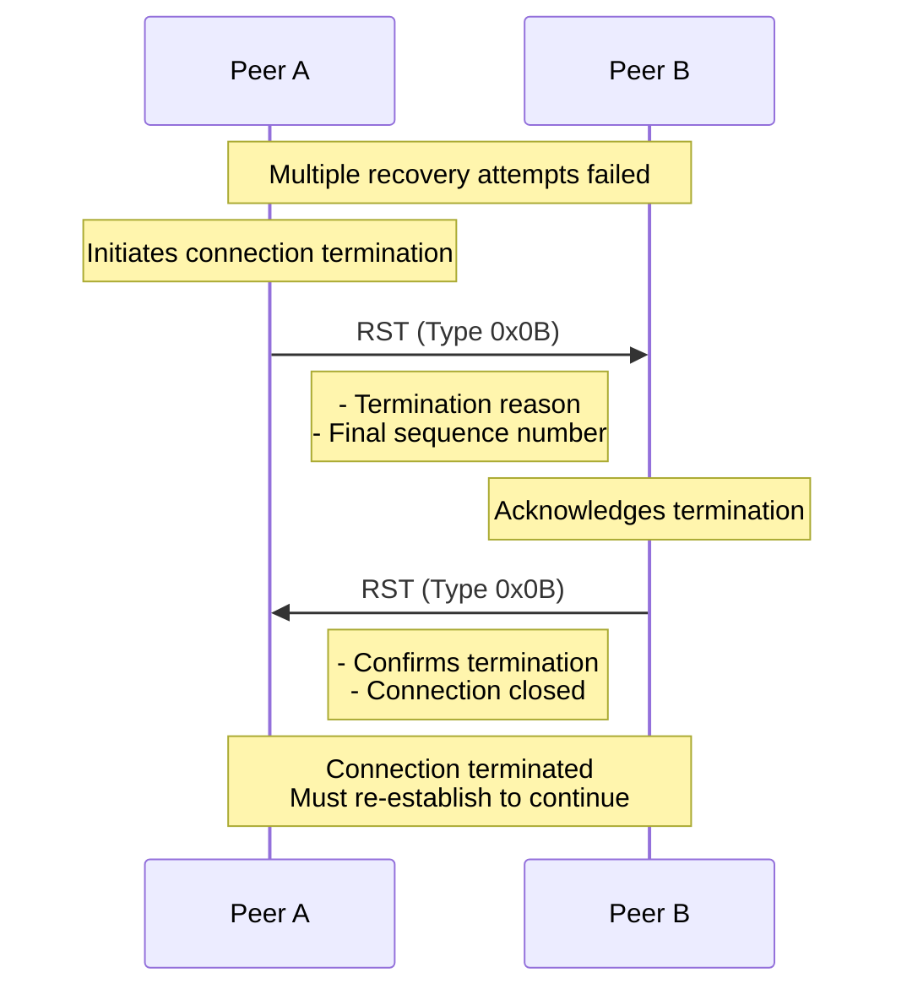
```mermaid
sequenceDiagram
    participant Peer A
    participant Peer B
    
    Note over Peer A,Peer B: Multiple recovery attempts failed
    Note over Peer A: Initiates connection termination
    
    Peer A->>Peer B: RST (Type 0x0B)
    Note right of Peer A: - Termination reason<br/>- Final sequence number
    
    Note over Peer B: Acknowledges termination
    Peer B->>Peer A: RST (Type 0x0B)
    Note left of Peer B: - Confirms termination<br/>- Connection closed
    
    Note over Peer A,Peer B: Connection terminated<br/>Must re-establish to continue
```

## 5. Connection Termination

### 5.1 Graceful Connection Termination

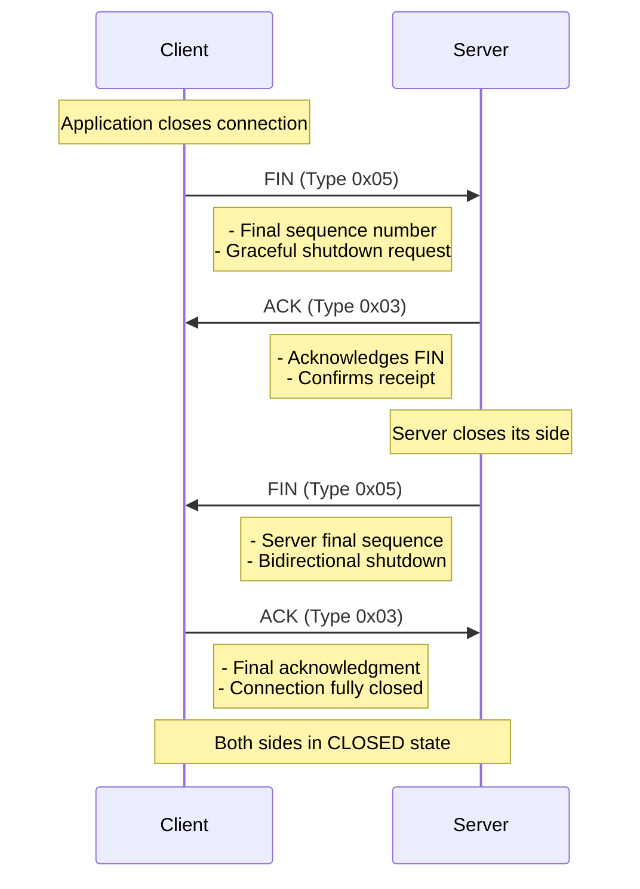
```mermaid
sequenceDiagram
    participant Client
    participant Server
    
    Note over Client: Application closes connection
    Client->>Server: FIN (Type 0x05)
    Note right of Client: - Final sequence number<br/>- Graceful shutdown request
    
    Server->>Client: ACK (Type 0x03)
    Note left of Server: - Acknowledges FIN<br/>- Confirms receipt
    
    Note over Server: Server closes its side
    Server->>Client: FIN (Type 0x05)
    Note left of Server: - Server final sequence<br/>- Bidirectional shutdown
    
    Client->>Server: ACK (Type 0x03)
    Note right of Client: - Final acknowledgment<br/>- Connection fully closed
    
    Note over Client,Server: Both sides in CLOSED state
```

### 5.2 Forceful Connection Reset

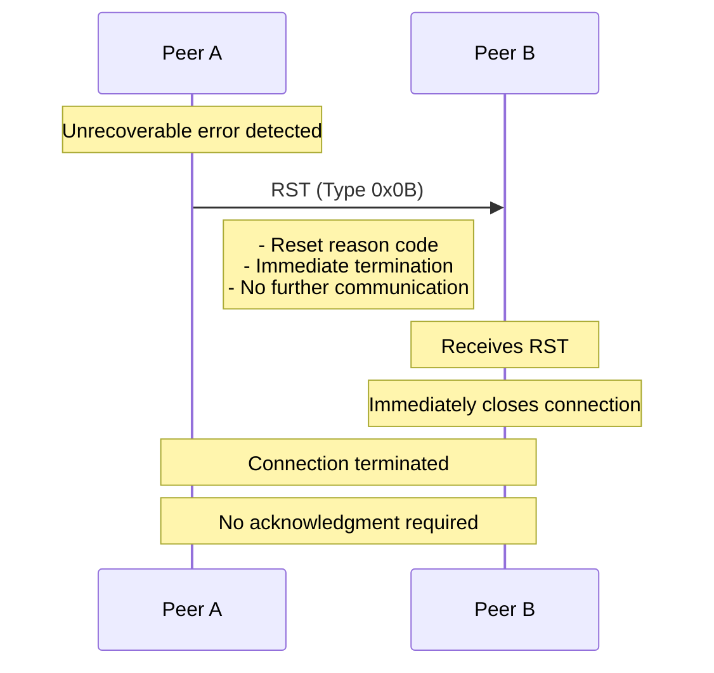
```mermaid
sequenceDiagram
    participant Peer A
    participant Peer B
    
    Note over Peer A: Unrecoverable error detected
    Peer A->>Peer B: RST (Type 0x0B)
    Note right of Peer A: - Reset reason code<br/>- Immediate termination<br/>- No further communication
    
    Note over Peer B: Receives RST
    Note over Peer B: Immediately closes connection
    Note over Peer A,Peer B: Connection terminated
    Note over Peer A,Peer B: No acknowledgment required
```

## 6. Error Handling Flows

### 6.1 Authentication Error Recovery

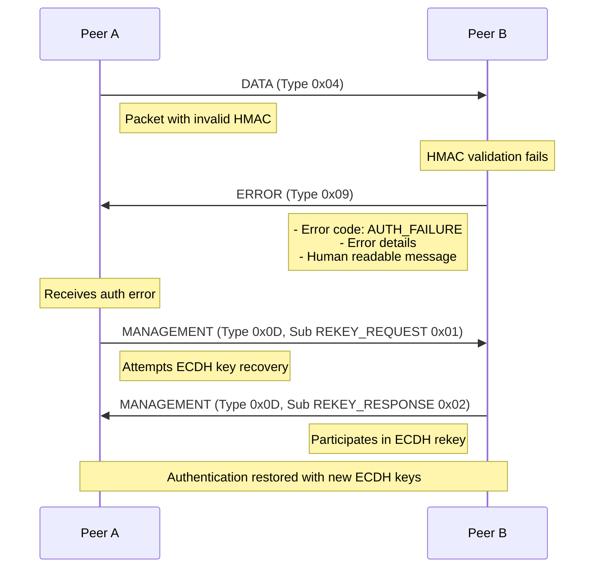
```mermaid
sequenceDiagram
    participant Peer A
    participant Peer B
    
    Peer A->>Peer B: DATA (Type 0x04)
    Note right of Peer A: Packet with invalid HMAC
    
    Note over Peer B: HMAC validation fails
    Peer B->>Peer A: ERROR (Type 0x09)
    Note left of Peer B: - Error code: AUTH_FAILURE<br/>- Error details<br/>- Human readable message
    
    Note over Peer A: Receives auth error
    Peer A->>Peer B: MANAGEMENT (Type 0x0D, Sub REKEY_REQUEST 0x01)
    Note right of Peer A: Attempts ECDH key recovery
    
    Peer B->>Peer A: MANAGEMENT (Type 0x0D, Sub REKEY_RESPONSE 0x02)
    Note left of Peer B: Participates in ECDH rekey
    
    Note over Peer A,Peer B: Authentication restored with new ECDH keys
```

### 6.2 Protocol Error with Recovery

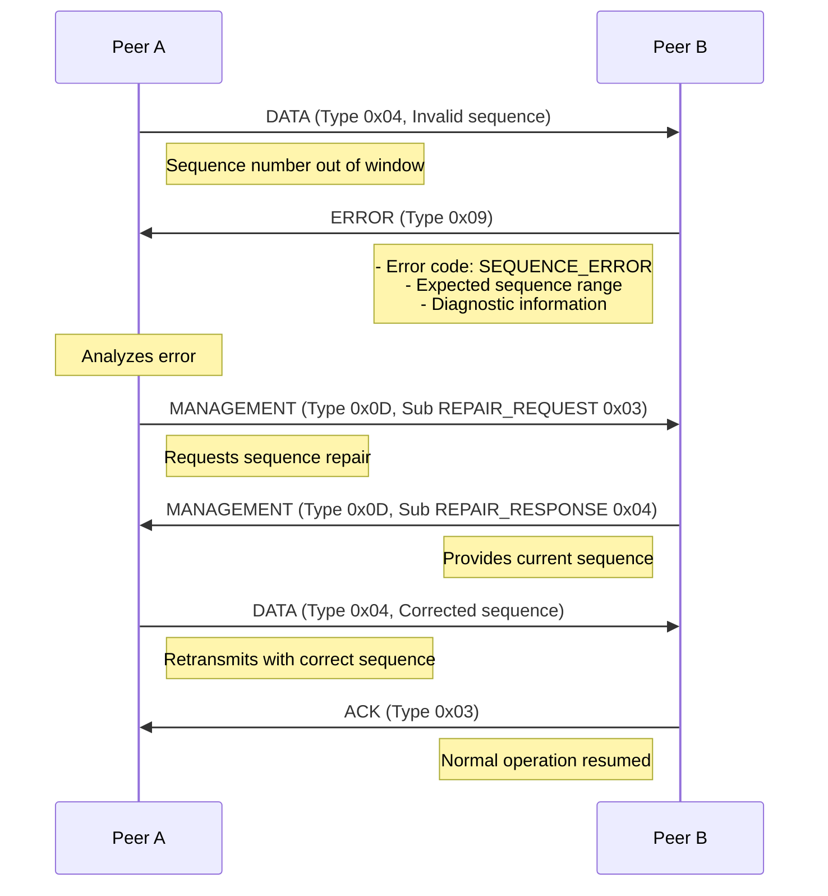
```mermaid
sequenceDiagram
    participant Peer A
    participant Peer B
    
    Peer A->>Peer B: DATA (Type 0x04, Invalid sequence)
    Note right of Peer A: Sequence number out of window
    
    Peer B->>Peer A: ERROR (Type 0x09)
    Note left of Peer B: - Error code: SEQUENCE_ERROR<br/>- Expected sequence range<br/>- Diagnostic information
    
    Note over Peer A: Analyzes error
    Peer A->>Peer B: MANAGEMENT (Type 0x0D, Sub REPAIR_REQUEST 0x03)
    Note right of Peer A: Requests sequence repair
    
    Peer B->>Peer A: MANAGEMENT (Type 0x0D, Sub REPAIR_RESPONSE 0x04)
    Note left of Peer B: Provides current sequence
    
    Peer A->>Peer B: DATA (Type 0x04, Corrected sequence)
    Note right of Peer A: Retransmits with correct sequence
    
    Peer B->>Peer A: ACK (Type 0x03)
    Note left of Peer B: Normal operation resumed
```

## 7. Heartbeat and Keep-Alive

### 7.1 Normal Heartbeat Exchange with Adaptive Networking

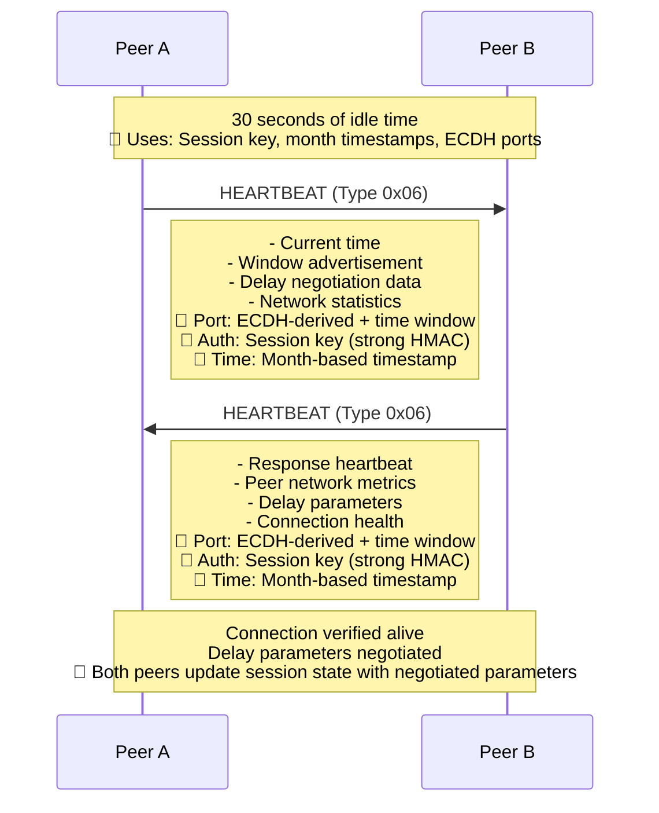
```mermaid
sequenceDiagram
    participant Peer A
    participant Peer B
    
    Note over Peer A,Peer B: 30 seconds of idle time<br/>🔑 Uses: Session key, month timestamps, ECDH ports
    
    Peer A->>Peer B: HEARTBEAT (Type 0x06)
    Note right of Peer A: - Current time<br/>- Window advertisement<br/>- Delay negotiation data<br/>- Network statistics<br/>🔑 Port: ECDH-derived + time window<br/>🔑 Auth: Session key (strong HMAC)<br/>🔑 Time: Month-based timestamp
    
    Peer B->>Peer A: HEARTBEAT (Type 0x06)
    Note left of Peer B: - Response heartbeat<br/>- Peer network metrics<br/>- Delay parameters<br/>- Connection health<br/>🔑 Port: ECDH-derived + time window<br/>🔑 Auth: Session key (strong HMAC)<br/>🔑 Time: Month-based timestamp
    
    Note over Peer A,Peer B: Connection verified alive<br/>Delay parameters negotiated<br/>🔑 Both peers update session state with negotiated parameters
```

### 7.2 Heartbeat Timeout and Recovery

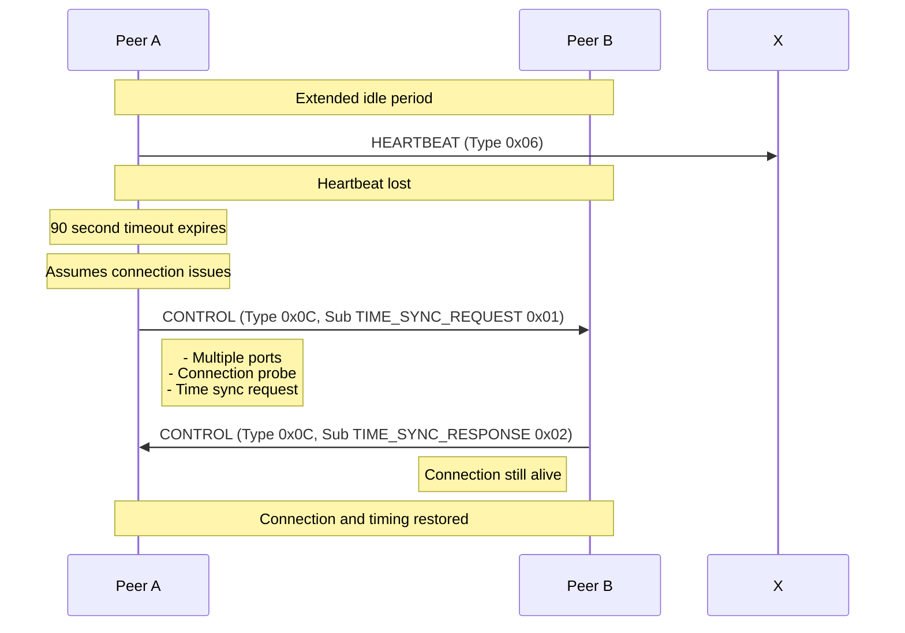
```mermaid
sequenceDiagram
    participant Peer A
    participant Peer B
    
    Note over Peer A,Peer B: Extended idle period
    
    Peer A->>X: HEARTBEAT (Type 0x06)
    Note over Peer A,Peer B: Heartbeat lost
    
    Note over Peer A: 90 second timeout expires
    Note over Peer A: Assumes connection issues
    
    Peer A->>Peer B: CONTROL (Type 0x0C, Sub TIME_SYNC_REQUEST 0x01)
    Note right of Peer A: - Multiple ports<br/>- Connection probe<br/>- Time sync request
    
    Peer B->>Peer A: CONTROL (Type 0x0C, Sub TIME_SYNC_RESPONSE 0x02)
    Note left of Peer B: Connection still alive
    
    Note over Peer A,Peer B: Connection and timing restored
```

## 8. Recovery Escalation Framework

### 8.1 Complete Recovery Escalation Sequence

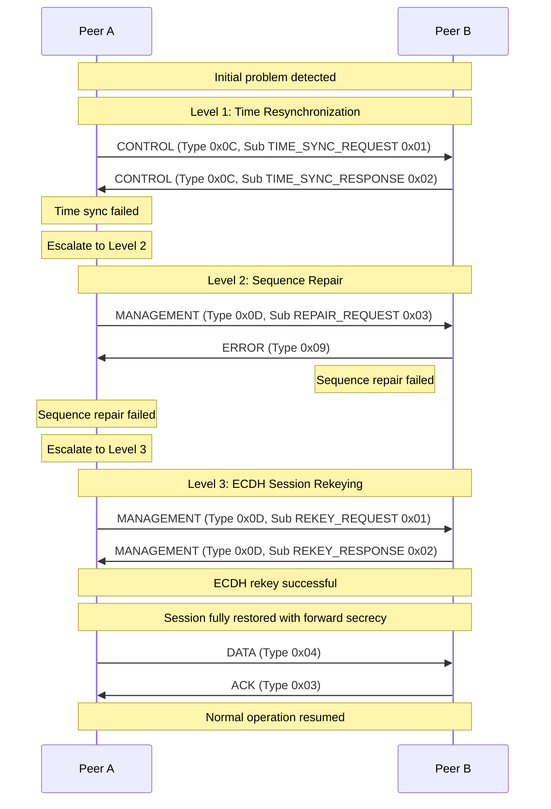
```mermaid
sequenceDiagram
    participant Peer A
    participant Peer B
    
    Note over Peer A,Peer B: Initial problem detected
    
    Note over Peer A,Peer B: Level 1: Time Resynchronization
    Peer A->>Peer B: CONTROL (Type 0x0C, Sub TIME_SYNC_REQUEST 0x01)
    Peer B->>Peer A: CONTROL (Type 0x0C, Sub TIME_SYNC_RESPONSE 0x02)
    
    Note over Peer A: Time sync failed
    Note over Peer A: Escalate to Level 2
    
    Note over Peer A,Peer B: Level 2: Sequence Repair
    Peer A->>Peer B: MANAGEMENT (Type 0x0D, Sub REPAIR_REQUEST 0x03)
    Peer B->>Peer A: ERROR (Type 0x09)
    Note left of Peer B: Sequence repair failed
    
    Note over Peer A: Sequence repair failed
    Note over Peer A: Escalate to Level 3
    
    Note over Peer A,Peer B: Level 3: ECDH Session Rekeying
    Peer A->>Peer B: MANAGEMENT (Type 0x0D, Sub REKEY_REQUEST 0x01)
    Peer B->>Peer A: MANAGEMENT (Type 0x0D, Sub REKEY_RESPONSE 0x02)
    
    Note over Peer A,Peer B: ECDH rekey successful
    Note over Peer A,Peer B: Session fully restored with forward secrecy
    
    Peer A->>Peer B: DATA (Type 0x04)
    Peer B->>Peer A: ACK (Type 0x03)
    
    Note over Peer A,Peer B: Normal operation resumed
```

### 8.2 Recovery Attempt Exhaustion

```mermaid
sequenceDiagram
    participant Peer A
    participant Peer B
    
    Note over Peer A: Maximum recovery attempts reached
    Note over Peer A: All recovery levels have failed
    
    Peer A->>Peer B: RST (Type 0x0B)
    Note right of Peer A: - Reset reason: RECOVERY_EXHAUSTED<br/>- Immediate termination<br/>- Session unrecoverable
    
    Note over Peer B: Receives RST
    Note over Peer B: Clears session state
    
    Note over Peer A,Peer B: Session terminated
    Note over Peer A,Peer B: New connection required
```

## 9. Advanced Fragmentation Scenarios

### 9.1 Fragment Timeout and Retransmission

```mermaid
sequenceDiagram
    participant Sender
    participant Receiver
    
    Sender->>Receiver: DATA (Fragment 0/3, ID 1234)
    Sender->>X: DATA (Fragment 1/3, ID 1234)
    Note over Sender,Receiver: Fragment 1 lost
    Sender->>Receiver: DATA (Fragment 2/3, ID 1234)
    
    Note over Receiver: 30 second timeout expires
    Note over Receiver: Fragment 1 missing
    
    Receiver->>Sender: ERROR (Type 0x09)
    Note left of Receiver: - Error: FRAGMENT_TIMEOUT<br/>- Fragment ID: 1234<br/>- Missing fragment bitmap
    
    Note over Sender: Retransmit missing fragment
    Sender->>Receiver: DATA (Fragment 1/3, ID 1234)
    Note right of Sender: Retransmission of lost fragment
    
    Note over Receiver: All fragments received
    Note over Receiver: Reassembly complete
    
    Receiver->>Sender: ACK (Type 0x03)
    Note left of Receiver: Acknowledges complete message
```

### 9.2 Fragment Overlap Attack Detection

```mermaid
sequenceDiagram
    participant Attacker
    participant Victim
    
    Attacker->>Victim: DATA (Fragment 0/3, ID 5678, Offset 0-500)
    Note right of Attacker: Normal first fragment
    
    Attacker->>Victim: DATA (Fragment 1/3, ID 5678, Offset 400-900)
    Note right of Attacker: Overlapping fragment attack
    
    Note over Victim: Detects overlap
    Note over Victim: Offset 400-500 overlap detected
    
    Victim->>Attacker: ERROR (Type 0x09)
    Note left of Victim: - Error: FRAGMENT_OVERLAP<br/>- Attack detected<br/>- Fragment discarded
    
    Note over Victim: Drops entire fragment set
    Note over Victim: Security violation logged
```

## 10. Flow Control and Congestion Management

### 10.1 Zero Window Probing

```mermaid
sequenceDiagram
    participant Sender
    participant Receiver
    
    Note over Receiver: Receive buffer full
    
    Receiver->>Sender: ACK (Type 0x03, Window=0)
    Note left of Receiver: - Zero window advertisement<br/>- Flow control stop
    
    Note over Sender: Window closed
    Note over Sender: Stop data transmission
    
    Note over Sender: 5 second probe timer expires
    Sender->>Receiver: DATA (Type 0x04, 1 byte probe)
    Note right of Sender: - Zero window probe<br/>- Single byte payload<br/>- Tests receiver readiness
    
    Receiver->>Sender: ACK (Type 0x03, Window=0)
    Note left of Receiver: Still no buffer space
    
    Note over Sender: Continue probing every 5 seconds
    
    Note over Receiver: Application reads data
    Note over Receiver: Buffer space available
    
    Receiver->>Sender: ACK (Type 0x03, Window=8192)
    Note left of Receiver: - Window opened<br/>- Buffer space available
    
    Sender->>Receiver: DATA (Type 0x04)
    Note right of Sender: Resume normal transmission
```

### 10.2 Flow Control Deadlock Resolution

```mermaid
sequenceDiagram
    participant Peer A
    participant Peer B
    
    Note over Peer A,Peer B: Both sides have zero windows
    
    Peer A->>Peer B: ACK (Type 0x03, Window=0)
    Peer B->>Peer A: ACK (Type 0x03, Window=0)
    
    Note over Peer A,Peer B: Deadlock detected
    
    Note over Peer A: Forced window update
    Peer A->>Peer B: ACK (Type 0x03, Window=1024)
    Note right of Peer A: - Emergency window opening<br/>- Minimum viable window<br/>- Deadlock prevention
    
    Peer B->>Peer A: DATA (Type 0x04, Small payload)
    Note left of Peer B: Sends minimum data
    
    Note over Peer A: Processes data
    Note over Peer A: Frees buffer space
    
    Peer A->>Peer B: ACK (Type 0x03, Window=4096)
    Note right of Peer A: Normal window advertisement
    
    Note over Peer A,Peer B: Flow control restored
```

## 11. Multi-Connection Management

### 11.1 Parallel Connection Establishment with Collision Avoidance

```mermaid
sequenceDiagram
    participant Client
    participant Server
    
    Note over Client,Server: Connection 1 Establishment
    Client->>Server: SYN (Session ID: 1234, ECDH offset derived)
    Server->>Client: SYN-ACK (Session ID: 1234)
    Client->>Server: ACK (Session ID: 1234)
    
    Note over Client,Server: Connection 2 Establishment (Different offset)
    Client->>Server: SYN (Session ID: 5678, Different ECDH offset)
    Server->>Client: SYN-ACK (Session ID: 5678)
    Client->>Server: ACK (Session ID: 5678)
    
    Note over Client,Server: Both connections active
    Note over Client,Server: Different ECDH-derived port ranges prevent collisions
    
    Client->>Server: DATA (Connection 1, Port range A)
    Client->>Server: DATA (Connection 2, Port range B)
    Server->>Client: ACK (Connection 1, Port range A)
    Server->>Client: ACK (Connection 2, Port range B)
```

### 11.2 Connection Port Collision Detection and Resolution

```mermaid
sequenceDiagram
    participant Client
    participant Server
    
    Note over Client,Server: Connection 1 established (uses full port range 1024-65535)
    
    Note over Client: Start Connection 2
    Client->>Server: SYN (Connection 2, port 27234)
    Note right of Client: - Different session ID<br/>- Full port range available<br/>- No collision concerns
    
    Note over Server: Routes by session ID
    Server->>Client: SYN-ACK (Connection 2, port 27234)
    Note left of Server: - Session ID determines routing<br/>- Port collisions irrelevant<br/>- Simplified connection handling
    
    Client->>Server: ACK (Connection 2, port 27234)
    
    Note over Client,Server: Both connections active
    Note over Client,Server: No port collisions
```

## 12. Security Attack Scenarios

### 12.1 Authentication Failure Cascade and Auto-Rekey

```mermaid
sequenceDiagram
    participant Peer A
    participant Peer B
    
    Peer A->>Peer B: DATA (Type 0x04, Invalid HMAC)
    Note right of Peer A: Authentication failure 1
    
    Note over Peer B: HMAC verification fails
    Peer B->>Peer A: ERROR (Type 0x09)
    Note left of Peer B: - Error: AUTH_FAILURE<br/>- HMAC mismatch<br/>- Failure count: 1
    
    Peer A->>Peer B: DATA (Type 0x04, Invalid HMAC)
    Note right of Peer A: Authentication failure 2
    
    Peer B->>Peer A: ERROR (Type 0x09)
    Note left of Peer B: - Error: AUTH_FAILURE<br/>- Failure count: 2<br/>- Warning threshold
    
    Peer A->>Peer B: DATA (Type 0x04, Invalid HMAC)
    Note right of Peer A: Authentication failure 3
    
    Note over Peer B: Threshold exceeded
    Note over Peer B: Trigger automatic ECDH rekey
    
    Peer B->>Peer A: MANAGEMENT (Type 0x0D, Sub REKEY_REQUEST 0x01)
    Note left of Peer B: - Automatic ECDH rekey triggered<br/>- Security threshold exceeded<br/>- Key compromise suspected
    
    Peer A->>Peer B: MANAGEMENT (Type 0x0D, Sub REKEY_RESPONSE 0x02)
    
    Note over Peer A,Peer B: New session key established with ECDH
    
    Peer A->>Peer B: DATA (Type 0x04, Valid HMAC)
    Peer B->>Peer A: ACK (Type 0x03)
    
    Note over Peer A,Peer B: Authentication restored with forward secrecy
```

### 12.2 Replay Attack Detection and Prevention

```mermaid
sequenceDiagram
    participant Attacker
    participant Victim
    
    Note over Attacker: Captures valid packet
    
    Victim->>Attacker: DATA (Type 0x04, Timestamp T1, Seq 100)
    Note left of Victim: Original valid packet
    
    Note over Attacker: Replays captured packet
    Attacker->>Victim: DATA (Type 0x04, Timestamp T1, Seq 100)
    Note right of Attacker: - Same timestamp T1<br/>- Same sequence 100<br/>- Replay attempt
    
    Note over Victim: Detects replay
    Note over Victim: - Timestamp T1 outside window<br/>- Sequence 100 already seen<br/>- Anti-replay triggered
    
    Victim->>Attacker: ERROR (Type 0x09)
    Note left of Victim: - Error: REPLAY_DETECTED<br/>- Packet discarded<br/>- Security violation logged
    
    Note over Victim: Increases replay threshold
    Note over Victim: Strengthens timestamp validation
```

## 13. PSK Discovery Failure Scenarios

### 13.1 PSK Discovery No Common Key Found

```mermaid
sequenceDiagram
    participant Client
    participant Server
    
    Client->>Server: DISCOVERY_REQUEST (Type 0x0E, Sub 0x01)
    Note right of Client: - Discovery ID<br/>- Client PSK commitments<br/>- Challenge nonce
    
    Server->>Client: DISCOVERY_RESPONSE (Type 0x0E, Sub 0x02)
    Note left of Server: - Empty PSK commitment list<br/>- No matching PSKs found<br/>- Error indication
    
    Note over Client: No compatible PSKs
    Client->>Server: ERROR (Type 0x09)
    Note right of Client: - Error: NO_COMMON_PSK<br/>- Connection terminated<br/>- No further attempts
    
    Note over Client,Server: Connection establishment failed
```

### 13.2 PSK Enumeration Attack Detection

```mermaid
sequenceDiagram
    participant Attacker
    participant Server
    
    Note over Attacker: Multiple rapid discovery attempts
    
    Attacker->>Server: DISCOVERY_REQUEST (Type 0x0E, Sub 0x01)
    Note right of Attacker: Attempt 1: Invalid PSK probe
    
    Attacker->>Server: DISCOVERY_REQUEST (Type 0x0E, Sub 0x01)
    Note right of Attacker: Attempt 2: Different PSK probe
    
    Attacker->>Server: DISCOVERY_REQUEST (Type 0x0E, Sub 0x01)
    Note right of Attacker: Attempt 3: Another PSK probe
    
    Note over Server: Detects enumeration pattern
    Note over Server: Rate limiting triggered
    
    Server->>Attacker: ERROR (Type 0x09)
    Note left of Server: - Error: RATE_LIMITED<br/>- 5 minute block duration<br/>- No further responses
    
    Note over Server: IP blocked for enumeration
```

## 14. Network Adaptation and Performance Optimization

### 14.1 Delay Parameter Negotiation via Enhanced Heartbeat

```mermaid
sequenceDiagram
    participant Peer A
    participant Peer B
    
    Note over Peer A,Peer B: Network conditions changing
    
    Peer A->>Peer B: HEARTBEAT (Type 0x06)
    Note right of Peer A: - Current delay window: 4<br/>- Measured jitter: 150ms<br/>- Loss rate: 2%<br/>- Propose window: 6
    
    Peer B->>Peer A: HEARTBEAT (Type 0x06)
    Note left of Peer B: - Current delay window: 4<br/>- Measured jitter: 200ms<br/>- Loss rate: 3%<br/>- Agree window: 6
    
    Note over Peer A,Peer B: Both agree on window size 6
    Note over Peer A,Peer B: Apply new delay parameters
    
    Note over Peer A,Peer B: Continue monitoring performance
    
    Peer A->>Peer B: HEARTBEAT (Type 0x06)
    Note right of Peer A: - Window 6 performance good<br/>- Jitter reduced: 100ms<br/>- Loss rate: 1%<br/>- Maintain current settings
    
    Note over Peer A,Peer B: Optimal delay parameters achieved
```

### 14.2 MTU Discovery and Dynamic Fragmentation

```mermaid
sequenceDiagram
    participant Sender
    participant Network
    participant Receiver
    
    Note over Sender: Large message (2000 bytes)
    Note over Sender: Assume MTU 1500
    
    Sender->>Network: DATA (1400 bytes, no fragment flag)
    Note right of Sender: Single packet attempt
    
    Network->>Sender: ICMP Fragmentation Needed (MTU 1200)
    Note over Network: Path MTU smaller than expected
    
    Note over Sender: Update MTU to 1200
    Note over Sender: Enable fragmentation
    
    Sender->>Receiver: DATA (Fragment 0/2, 1100 bytes)
    Sender->>Receiver: DATA (Fragment 1/2, 900 bytes)
    
    Note over Receiver: Reassemble fragments
    Receiver->>Sender: ACK (Type 0x03)
    
    Note over Sender,Receiver: Adaptive fragmentation established
```

## 15. Month Boundary and Timestamp Management

### 15.1 Month Boundary Timestamp Transition

```mermaid
sequenceDiagram
    participant Peer A
    participant Peer B
    
    Note over Peer A,Peer B: 1 hour before month boundary
    Note over Peer A,Peer B: March 31, 23:00 UTC
    
    Peer A->>Peer B: CONTROL (Type 0x0C, Sub TIME_SYNC_REQUEST 0x01)
    Note right of Peer A: - Month transition preparation<br/>- Sync before boundary<br/>- Current: March epoch
    
    Peer B->>Peer A: CONTROL (Type 0x0C, Sub TIME_SYNC_RESPONSE 0x02)
    Note left of Peer B: - Confirm preparation<br/>- March epoch alignment<br/>- Ready for transition
    
    Note over Peer A,Peer B: Month boundary: April 1, 00:00 UTC
    Note over Peer A,Peer B: Both detect new month epoch
    
    Note over Peer A: Update timestamp calculations
    Note over Peer A: Reset to April epoch (ms since April 1)
    Note over Peer B: Update timestamp calculations
    Note over Peer B: Reset to April epoch (ms since April 1)
    
    Peer A->>Peer B: DATA (Type 0x04, April timestamp)
    Note right of Peer A: First packet with April epoch
    
    Peer B->>Peer A: ACK (Type 0x03, April timestamp)
    Note left of Peer B: Confirm April epoch working
    
    Note over Peer A,Peer B: Month boundary transition complete
```

### 15.2 Clock Regression Handling

```mermaid
sequenceDiagram
    participant Peer A
    participant Peer B
    
    Note over Peer A,Peer B: Normal operation with synchronized time
    
    Peer A->>Peer B: DATA (Type 0x04, Timestamp T1)
    Note right of Peer A: Current time: T1
    
    Note over Peer A: System time correction occurs
    Note over Peer A: Clock moves backward 30 seconds
    
    Note over Peer A: Detects clock regression
    Note over Peer A: Current time < last sent timestamp
    
    Peer A->>Peer B: CONTROL (Type 0x0C, Sub TIME_SYNC_REQUEST 0x01)
    Note right of Peer A: - Emergency time sync<br/>- Clock regression detected<br/>- Request time validation
    
    Peer B->>Peer A: CONTROL (Type 0x0C, Sub TIME_SYNC_RESPONSE 0x02)
    Note left of Peer B: - Provide reference time<br/>- Detect regression<br/>- Calculate adjustment
    
    Note over Peer A: Calculate time offset adjustment
    Note over Peer A: Apply gradual correction
    
    Peer A->>Peer B: DATA (Type 0x04, Corrected timestamp)
    Note right of Peer A: Resume with adjusted time
    
    Note over Peer A,Peer B: Synchronization restored
```

### 15.3 Leap Second Handling

```mermaid
sequenceDiagram
    participant Peer A
    participant Peer B
    
    Note over Peer A,Peer B: 2 seconds before leap second
    Note over Peer A,Peer B: 23:59:58 UTC
    
    Note over Peer A: Leap second event detected
    Note over Peer B: Leap second event detected
    
    Note over Peer A,Peer B: Pause time adjustments
    Note over Peer A,Peer B: Enter leap second window
    
    Note over Peer A,Peer B: 23:59:60 UTC (leap second)
    
    Peer A->>Peer B: DATA (Type 0x04, Leap second timestamp)
    Note right of Peer A: Special leap second handling
    
    Peer B->>Peer A: ACK (Type 0x03, Leap second timestamp)
    Note left of Peer B: Acknowledge leap second packet
    
    Note over Peer A,Peer B: 00:00:00 UTC (next day)
    Note over Peer A,Peer B: Resume normal time calculations
    
    Note over Peer A: Update time synchronization
    Note over Peer B: Update time synchronization
    
    Peer A->>Peer B: CONTROL (Type 0x0C, Sub TIME_SYNC_REQUEST 0x01)
    Note right of Peer A: Post-leap verification sync
    
    Peer B->>Peer A: CONTROL (Type 0x0C, Sub TIME_SYNC_RESPONSE 0x02)
    Note left of Peer B: Confirm post-leap sync
    
    Note over Peer A,Peer B: Normal operation resumed
```

## 16. Session Management and Configuration

### 16.1 Session ID Collision Resolution

```mermaid
sequenceDiagram
    participant Client A
    participant Server
    participant Client B
    
    Note over Client A,Server,Client B: Both clients generate same session ID
    
    Client A->>Server: SYN (Session ID: 12345, Endpoint: A)
    Note right of Client A: Connection attempt with ID 12345
    
    Client B->>Server: SYN (Session ID: 12345, Endpoint: B)
    Note left of Client B: Collision! Same session ID
    
    Note over Server: Session ID collision detected
    Note over Server: Compare endpoints: A < B
    Note over Server: Client A wins collision
    
    Server->>Client A: SYN-ACK (Session ID: 12345)
    Note left of Server: Accept Client A's connection
    
    Server->>Client B: ERROR (Type 0x09)
    Note left of Server: - Error: SESSION_ID_COLLISION<br/>- Collision detected<br/>- Retry with new ID
    
    Note over Client B: Generate new session ID
    Client B->>Server: SYN (Session ID: 67890)
    Note left of Client B: Retry with different ID
    
    Server->>Client B: SYN-ACK (Session ID: 67890)
    Note left of Server: Accept retry connection
    
    Note over Client A,Server,Client B: Both connections established
```

### 16.2 HMAC Policy Negotiation and Escalation

```mermaid
sequenceDiagram
    participant Peer A
    participant Peer B
    
    Note over Peer A,Peer B: Initial connection with HMAC_LIGHT (32-bit)
    
    Peer A->>Peer B: DATA (Type 0x04, 32-bit HMAC)
    Note right of Peer A: HMAC failure 1
    
    Note over Peer B: HMAC validation fails
    Peer B->>Peer A: ERROR (Type 0x09)
    Note left of Peer B: - Auth failure count: 1<br/>- Continue with HMAC_LIGHT
    
    Peer A->>Peer B: DATA (Type 0x04, 32-bit HMAC)
    Note right of Peer A: HMAC failure 2
    
    Peer B->>Peer A: ERROR (Type 0x09)
    Note left of Peer B: - Auth failure count: 2<br/>- Threshold approaching
    
    Peer A->>Peer B: DATA (Type 0x04, 32-bit HMAC)
    Note right of Peer A: HMAC failure 3
    
    Note over Peer B: Authentication failure threshold exceeded
    Note over Peer B: Escalate to HMAC_STRONG (64-bit)
    
    Peer B->>Peer A: CONTROL (Type 0x0C, Sub HMAC_POLICY_CHANGE)
    Note left of Peer B: - Request HMAC escalation<br/>- New policy: HMAC_STRONG<br/>- Security enhancement
    
    Peer A->>Peer B: CONTROL (Type 0x0C, Sub HMAC_POLICY_ACK)
    Note right of Peer A: - Acknowledge policy change<br/>- Switch to 64-bit HMAC
    
    Peer A->>Peer B: DATA (Type 0x04, 64-bit HMAC)
    Note right of Peer A: First packet with stronger HMAC
    
    Peer B->>Peer A: ACK (Type 0x03)
    Note left of Peer B: Authentication restored
    
    Note over Peer A,Peer B: Enhanced security with HMAC_STRONG
```

## 17. PSK Discovery Edge Cases

### 17.1 PSK Discovery No Common Key Found

```mermaid
sequenceDiagram
    participant Client
    participant Server
    
    Client->>Server: DISCOVERY_REQUEST (Type 0x0E, Sub 0x01)
    Note right of Client: - Discovery ID<br/>- Bloom filter of client PSKs<br/>- Fingerprint count
    
    Note over Server: Test server PSKs against Bloom filter
    Note over Server: No matches found in Bloom filter
    
    Server->>Client: DISCOVERY_RESPONSE (Type 0x0E, Sub 0x02)
    Note left of Server: - Empty candidate list<br/>- Intersection status: NO_MATCHES<br/>- No shared PSKs available
    
    Note over Client: No compatible PSKs found
    
    Client->>Server: ERROR (Type 0x09)
    Note right of Client: - Error: NO_COMMON_PSK<br/>- Connection impossible<br/>- Terminate discovery
    
    Note over Client,Server: Connection establishment failed
    Note over Client,Server: Different PSK sets - no communication possible
```

### 17.2 PSK Enumeration Attack Detection

```mermaid
sequenceDiagram
    participant Attacker
    participant Server
    
    Note over Attacker: Attempts to enumerate PSKs
    
    Attacker->>Server: DISCOVERY_REQUEST (Type 0x0E, Sub 0x01)
    Note right of Attacker: - Probe attempt 1<br/>- Minimal Bloom filter<br/>- Test specific PSK patterns
    
    Attacker->>Server: DISCOVERY_REQUEST (Type 0x0E, Sub 0x01)
    Note right of Attacker: - Probe attempt 2<br/>- Different Bloom filter<br/>- Test different PSK patterns
    
    Attacker->>Server: DISCOVERY_REQUEST (Type 0x0E, Sub 0x01)
    Note right of Attacker: - Probe attempt 3<br/>- Rapid successive attempts<br/>- Enumeration pattern
    
    Note over Server: Detect enumeration pattern
    Note over Server: - Multiple requests from same source<br/>- Varying Bloom filter patterns<br/>- Rate exceeds threshold
    
    Server->>Attacker: ERROR (Type 0x09)
    Note left of Server: - Error: RATE_LIMITED<br/>- Enumeration attack detected<br/>- 5 minute block duration
    
    Note over Server: Block source IP address
    Note over Server: Log security violation
    
    Attacker->>Server: DISCOVERY_REQUEST (Type 0x0E, Sub 0x01)
    Note right of Attacker: Continued enumeration attempt
    
    Note over Server: Source blocked - silently discard
    
    Note over Server: PSK enumeration attack mitigated
```

## 18. Advanced Fragment Management

### 18.1 Fragment Bomb Attack Detection

```mermaid
sequenceDiagram
    participant Attacker
    participant Victim
    
    Note over Attacker: Attempts fragment bomb attack
    
    Attacker->>Victim: DATA (Fragment 0/999, ID 1000)
    Note right of Attacker: Excessive fragment count
    
    Note over Victim: Validate fragment parameters
    Note over Victim: total_fragments = 999 > MAX_FRAGMENTS (255)
    
    Victim->>Attacker: ERROR (Type 0x09)
    Note left of Victim: - Error: FRAGMENT_BOMB_DETECTED<br/>- Excessive fragment count<br/>- Attack blocked
    
    Note over Victim: Log security violation
    Note over Victim: Block source for 5 minutes
    
    Attacker->>Victim: DATA (Fragment 0/100, ID 1001)
    Note right of Attacker: Second attack attempt
    
    Note over Victim: Source is blocked
    Note over Victim: Silently discard packet
    
    Note over Victim: Fragment bomb attack mitigated
```

### 18.2 Selective Fragment Retransmission

```mermaid
sequenceDiagram
    participant Sender
    participant Receiver
    
    Sender->>Receiver: DATA (Fragment 0/5, ID 2000)
    Sender->>X: DATA (Fragment 1/5, ID 2000)
    Note over Sender,Receiver: Fragment 1 lost
    Sender->>Receiver: DATA (Fragment 2/5, ID 2000)
    Sender->>X: DATA (Fragment 3/5, ID 2000)
    Note over Sender,Receiver: Fragment 3 lost
    Sender->>Receiver: DATA (Fragment 4/5, ID 2000)
    
    Note over Receiver: Fragment timeout (30 seconds)
    Note over Receiver: Missing fragments: 1, 3
    
    Receiver->>Sender: ERROR (Type 0x09)
    Note left of Receiver: - Error: FRAGMENT_TIMEOUT<br/>- Fragment ID: 2000<br/>- Missing bitmap: 1010000
    
    Note over Sender: Parse missing fragment bitmap
    Note over Sender: Identify fragments 1 and 3 needed
    
    Sender->>Receiver: DATA (Fragment 1/5, ID 2000)
    Note right of Sender: Retransmit fragment 1 only
    
    Sender->>Receiver: DATA (Fragment 3/5, ID 2000)
    Note right of Sender: Retransmit fragment 3 only
    
    Note over Receiver: All fragments received
    Note over Receiver: Reassembly complete
    
    Receiver->>Sender: ACK (Type 0x03)
    Note left of Receiver: Acknowledge complete message
```

## 19. Recovery Escalation and Exhaustion

### 19.1 Complete Recovery Exhaustion Scenario

```mermaid
sequenceDiagram
    participant Peer A
    participant Peer B
    
    Note over Peer A,Peer B: Multiple connection issues
    
    Note over Peer A,Peer B: Recovery Level 1: Time Sync (Attempt 1/3)
    Peer A->>Peer B: CONTROL (Time sync request)
    Peer B->>X: Response lost
    Note over Peer A: Timeout - attempt 1 failed
    
    Note over Peer A,Peer B: Recovery Level 1: Time Sync (Attempt 2/3)
    Peer A->>Peer B: CONTROL (Time sync request)
    Peer B->>Peer A: ERROR (Time sync failed)
    Note over Peer A: Time sync failed - attempt 2 failed
    
    Note over Peer A,Peer B: Recovery Level 1: Time Sync (Attempt 3/3)
    Peer A->>Peer B: CONTROL (Time sync request)
    Peer B->>Peer A: ERROR (Time sync failed)
    Note over Peer A: Level 1 exhausted - escalate
    
    Note over Peer A,Peer B: Recovery Level 2: Sequence Repair (Attempt 1/3)
    Peer A->>Peer B: MANAGEMENT (Repair request)
    Peer B->>Peer A: ERROR (Repair failed)
    Note over Peer A: Repair failed - attempt 1 failed
    
    Note over Peer A,Peer B: Recovery Level 2: Sequence Repair (Attempt 2/3)
    Peer A->>Peer B: MANAGEMENT (Repair request)
    Peer B->>Peer A: ERROR (Repair failed)
    Note over Peer A: Repair failed - attempt 2 failed
    
    Note over Peer A,Peer B: Recovery Level 2: Sequence Repair (Attempt 3/3)
    Peer A->>Peer B: MANAGEMENT (Repair request)
    Peer B->>Peer A: ERROR (Repair failed)
    Note over Peer A: Level 2 exhausted - escalate
    
    Note over Peer A,Peer B: Recovery Level 3: ECDH Rekey (Attempt 1/3)
    Peer A->>Peer B: MANAGEMENT (Rekey request)
    Peer B->>Peer A: ERROR (Rekey failed)
    Note over Peer A: Rekey failed - attempt 1 failed
    
    Note over Peer A,Peer B: Recovery Level 3: ECDH Rekey (Attempt 2/3)
    Peer A->>Peer B: MANAGEMENT (Rekey request)
    Peer B->>Peer A: ERROR (Rekey failed)
    Note over Peer A: Rekey failed - attempt 2 failed
    
    Note over Peer A,Peer B: Recovery Level 3: ECDH Rekey (Attempt 3/3)
    Peer A->>Peer B: MANAGEMENT (Rekey request)
    Peer B->>Peer A: ERROR (Rekey failed)
    Note over Peer A: All recovery levels exhausted
    
    Note over Peer A: Maximum recovery attempts reached
    Note over Peer A: Connection unrecoverable
    
    Peer A->>Peer B: RST (Type 0x0B)
    Note right of Peer A: - Reset reason: RECOVERY_EXHAUSTED<br/>- All recovery methods failed<br/>- Session terminated
    
    Note over Peer A,Peer B: Connection terminated
    Note over Peer A,Peer B: New connection required
```

## 20. Sequence Number Management

### 20.1 Sequence Number Wraparound Negotiation

```mermaid
sequenceDiagram
    participant Peer A
    participant Peer B
    
    Note over Peer A,Peer B: Sequence numbers approaching 32-bit limit
    Note over Peer A: Current sequence: 4,294,960,000
    Note over Peer B: Current sequence: 4,294,950,000
    
    Note over Peer A: Detect wraparound threshold
    Note over Peer A: Sequence > 0x80000000 (2^31)
    
    Peer A->>Peer B: CONTROL (Type 0x0C, Sub SEQUENCE_NEG 0x04)
    Note right of Peer A: - Wraparound negotiation request<br/>- Current sequence: 4,294,960,000<br/>- Request coordinated wraparound
    
    Note over Peer B: Check own sequence proximity
    Note over Peer B: Also near wraparound threshold
    
    Peer B->>Peer A: CONTROL (Type 0x0C, Sub SEQUENCE_NEG 0x04)
    Note left of Peer B: - Confirm wraparound readiness<br/>- Current sequence: 4,294,950,000<br/>- Ready for coordinated reset
    
    Note over Peer A,Peer B: Both peers ready for wraparound
    Note over Peer A,Peer B: Coordinate reset at next time window boundary
    
    Note over Peer A,Peer B: Time window boundary reached
    Note over Peer A: Reset sequence to 0
    Note over Peer B: Reset sequence to 0
    
    Peer A->>Peer B: DATA (Type 0x04, Sequence: 0)
    Note right of Peer A: First packet with wrapped sequence
    
    Peer B->>Peer A: ACK (Type 0x03, Ack: 1)
    Note left of Peer B: Acknowledge wraparound successful
    
    Note over Peer A,Peer B: Sequence wraparound complete
    Note over Peer A,Peer B: Continue with sequences starting from 0
```
