# Protocol Sequence Diagrams

## Overview

This document provides comprehensive sequence diagrams illustrating all critical protocol flows and interactions. These diagrams show the message exchanges, state transitions, and timing relationships between peers during various protocol operations including connection establishment, data transmission, recovery scenarios, and connection termination.

## Purpose and Rationale

Sequence diagrams serve essential documentation and implementation functions:

- **Flow Visualization**: Provides clear visual representation of complex protocol interactions and message sequences
- **Implementation Guidance**: Helps developers understand the correct order and timing of protocol operations
- **Debugging Aid**: Enables troubleshooting by showing expected message flows versus actual behavior
- **Protocol Validation**: Allows verification that implementations follow the correct sequence of operations
- **Edge Case Documentation**: Illustrates how the protocol handles various error conditions and recovery scenarios

The diagrams complement the technical specifications by showing the dynamic behavior and interactions that emerge from the static protocol definitions.

## Key Concepts

- **Message Flow**: The sequence and direction of packet exchanges between peers
- **State Synchronization**: How peer states change in coordination during protocol operations
- **Timing Dependencies**: Critical timing relationships and synchronization requirements
- **Error Handling**: How the protocol responds to and recovers from various failure conditions
- **Parallel Operations**: Concurrent activities that can occur simultaneously during protocol operation
- **Optimized Headers**: All packets use the 50-byte optimized common header format for efficiency
- **Sub-Type Architecture**: CONTROL, MANAGEMENT, and DISCOVERY packets use sub-types for functionality consolidation

## 1. Connection Establishment Flow

### 1.1 Basic Connection Establishment (No PSK Discovery)

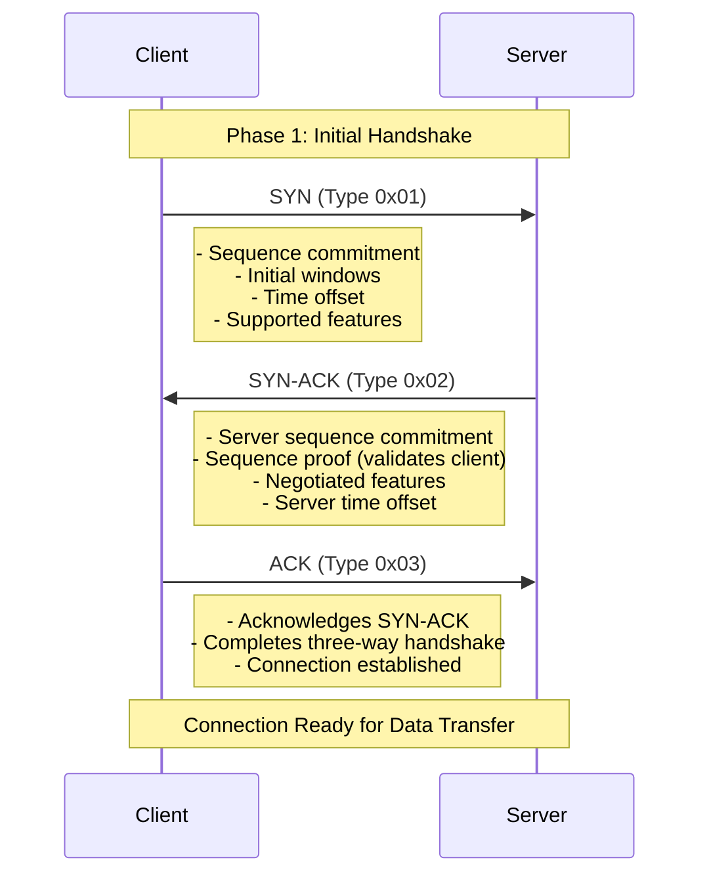
```mermaid
sequenceDiagram
    participant Client
    participant Server
    
    Note over Client,Server: Phase 1: Initial Handshake
    Client->>Server: SYN (Type 0x01)
    Note right of Client: - Sequence commitment<br/>- Initial windows<br/>- Time offset<br/>- Supported features
    
    Server->>Client: SYN-ACK (Type 0x02)
    Note left of Server: - Server sequence commitment<br/>- Sequence proof (validates client)<br/>- Negotiated features<br/>- Server time offset
    
    Client->>Server: ACK (Type 0x03)
    Note right of Client: - Acknowledges SYN-ACK<br/>- Completes three-way handshake<br/>- Connection established
    
    Note over Client,Server: Connection Ready for Data Transfer
```

### 1.2 Connection Establishment with PSK Discovery

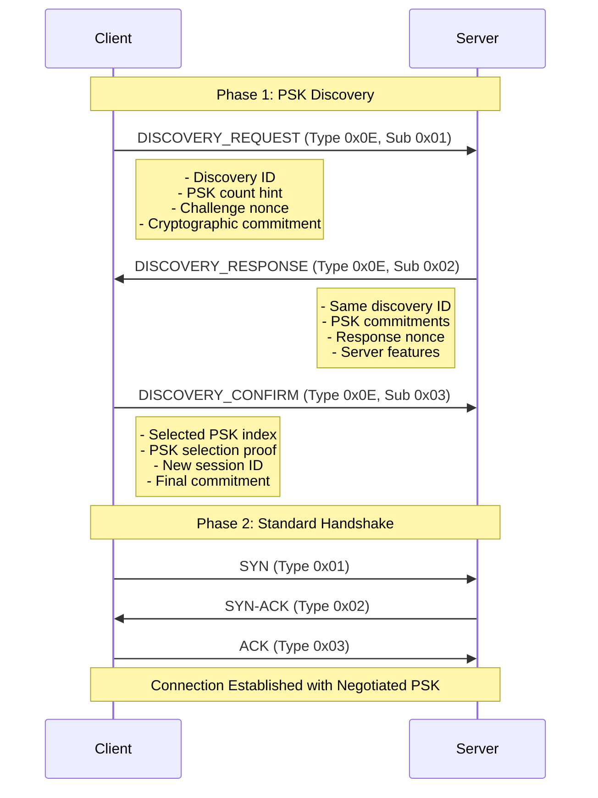
```mermaid
sequenceDiagram
    participant Client
    participant Server
    
    Note over Client,Server: Phase 1: PSK Discovery
    Client->>Server: DISCOVERY_REQUEST (Type 0x0E, Sub 0x01)
    Note right of Client: - Discovery ID<br/>- PSK count hint<br/>- Challenge nonce<br/>- Cryptographic commitment
    
    Server->>Client: DISCOVERY_RESPONSE (Type 0x0E, Sub 0x02)
    Note left of Server: - Same discovery ID<br/>- PSK commitments<br/>- Response nonce<br/>- Server features
    
    Client->>Server: DISCOVERY_CONFIRM (Type 0x0E, Sub 0x03)
    Note right of Client: - Selected PSK index<br/>- PSK selection proof<br/>- New session ID<br/>- Final commitment
    
    Note over Client,Server: Phase 2: Standard Handshake
    Client->>Server: SYN (Type 0x01)
    Server->>Client: SYN-ACK (Type 0x02)
    Client->>Server: ACK (Type 0x03)
    
    Note over Client,Server: Connection Established with Negotiated PSK
```

### 1.3 Connection Establishment with ECDH Key Exchange

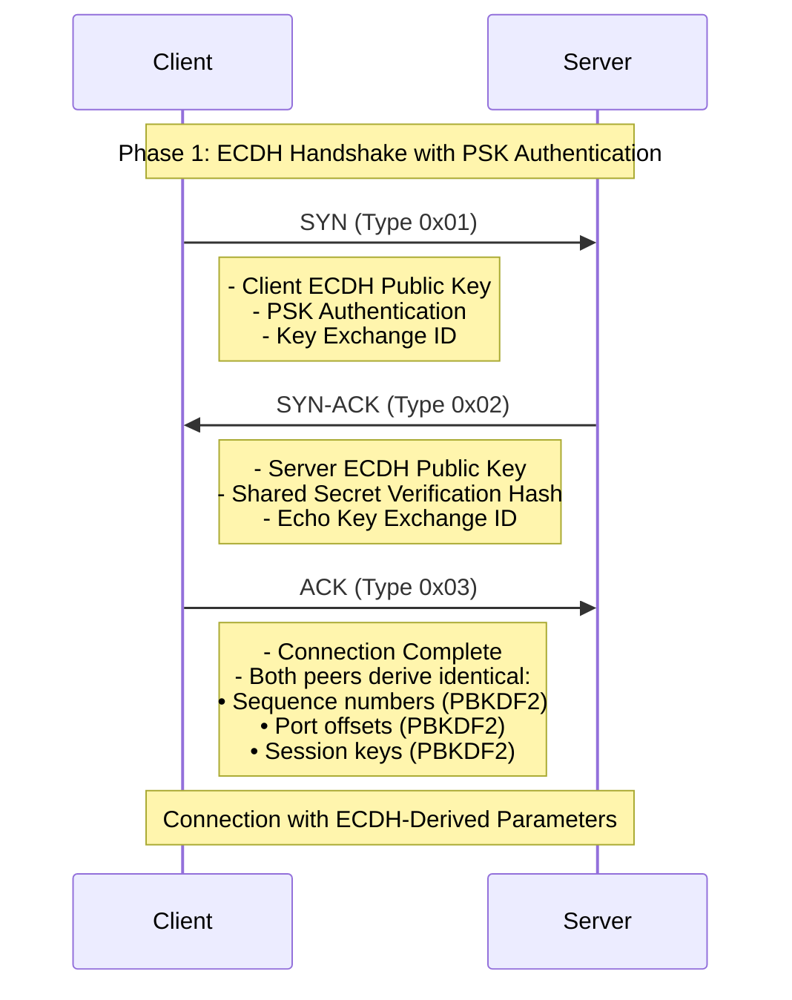
```mermaid
sequenceDiagram
    participant Client
    participant Server
    
    Note over Client,Server: Phase 1: ECDH Handshake with PSK Authentication
    Client->>Server: SYN (Type 0x01)
    Note right of Client: - Client ECDH Public Key<br/>- PSK Authentication<br/>- Key Exchange ID
    
    Server->>Client: SYN-ACK (Type 0x02)
    Note left of Server: - Server ECDH Public Key<br/>- Shared Secret Verification Hash<br/>- Echo Key Exchange ID
    
    Client->>Server: ACK (Type 0x03)
    Note right of Client: - Connection Complete<br/>- Both peers derive identical:<br/>  • Sequence numbers (PBKDF2)<br/>  • Port offsets (PBKDF2)<br/>  • Session keys (PBKDF2)
    
    Note over Client,Server: Connection with ECDH-Derived Parameters
```

### 1.4 Privacy-Preserving PSK Discovery

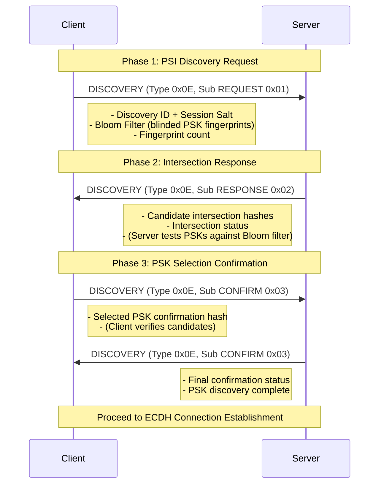
```mermaid
sequenceDiagram
    participant Client
    participant Server
    
    Note over Client,Server: Phase 1: PSI Discovery Request
    Client->>Server: DISCOVERY (Type 0x0E, Sub REQUEST 0x01)
    Note right of Client: - Discovery ID + Session Salt<br/>- Bloom Filter (blinded PSK fingerprints)<br/>- Fingerprint count
    
    Note over Client,Server: Phase 2: Intersection Response
    Server->>Client: DISCOVERY (Type 0x0E, Sub RESPONSE 0x02)
    Note left of Server: - Candidate intersection hashes<br/>- Intersection status<br/>- (Server tests PSKs against Bloom filter)
    
    Note over Client,Server: Phase 3: PSK Selection Confirmation
    Client->>Server: DISCOVERY (Type 0x0E, Sub CONFIRM 0x03)
    Note right of Client: - Selected PSK confirmation hash<br/>- (Client verifies candidates)
    
    Server->>Client: DISCOVERY (Type 0x0E, Sub CONFIRM 0x03)
    Note left of Server: - Final confirmation status<br/>- PSK discovery complete
    
    Note over Client,Server: Proceed to ECDH Connection Establishment
```

## 2. Data Transmission Flows

### 2.1 Normal Data Transmission with Flow Control

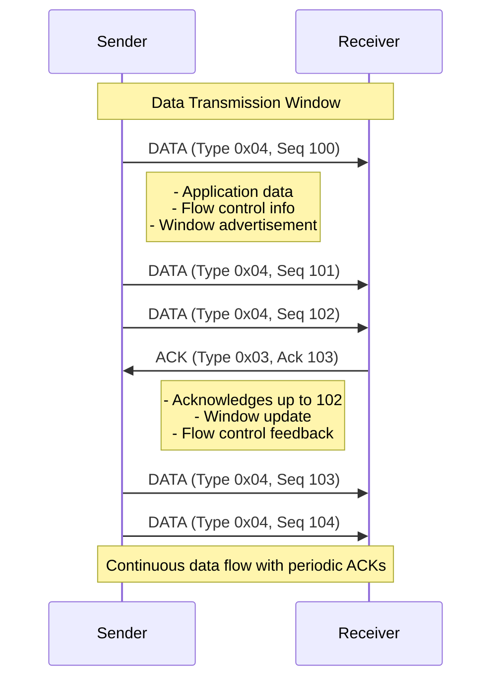
```mermaid
sequenceDiagram
    participant Sender
    participant Receiver
    
    Note over Sender,Receiver: Data Transmission Window
    Sender->>Receiver: DATA (Type 0x04, Seq 100)
    Note right of Sender: - Application data<br/>- Flow control info<br/>- Window advertisement
    
    Sender->>Receiver: DATA (Type 0x04, Seq 101)
    Sender->>Receiver: DATA (Type 0x04, Seq 102)
    
    Receiver->>Sender: ACK (Type 0x03, Ack 103)
    Note left of Receiver: - Acknowledges up to 102<br/>- Window update<br/>- Flow control feedback
    
    Sender->>Receiver: DATA (Type 0x04, Seq 103)
    Sender->>Receiver: DATA (Type 0x04, Seq 104)
    
    Note over Sender,Receiver: Continuous data flow with periodic ACKs
```

### 2.2 Data Transmission with Packet Loss and SACK

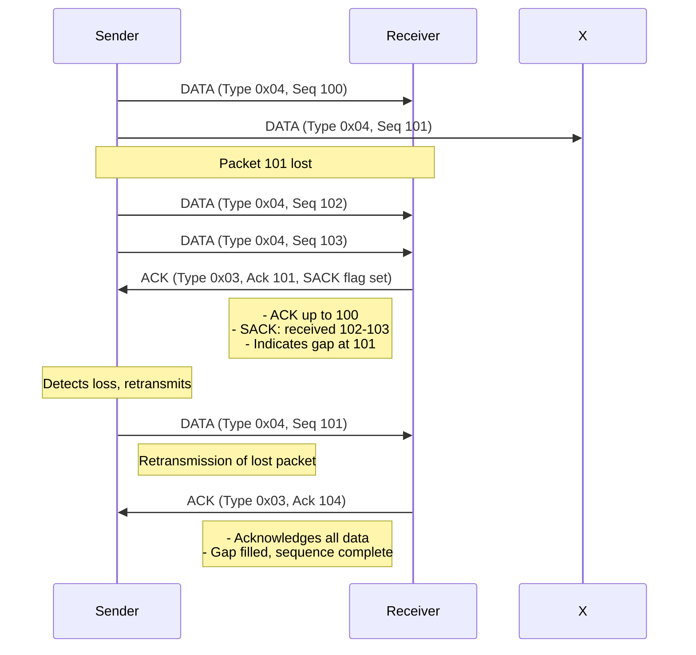
```mermaid
sequenceDiagram
    participant Sender
    participant Receiver
    
    Sender->>Receiver: DATA (Type 0x04, Seq 100)
    Sender->>X: DATA (Type 0x04, Seq 101)
    Note over Sender,Receiver: Packet 101 lost
    Sender->>Receiver: DATA (Type 0x04, Seq 102)
    Sender->>Receiver: DATA (Type 0x04, Seq 103)
    
    Receiver->>Sender: ACK (Type 0x03, Ack 101, SACK flag set)
    Note left of Receiver: - ACK up to 100<br/>- SACK: received 102-103<br/>- Indicates gap at 101
    
    Note over Sender: Detects loss, retransmits
    Sender->>Receiver: DATA (Type 0x04, Seq 101)
    Note right of Sender: Retransmission of lost packet
    
    Receiver->>Sender: ACK (Type 0x03, Ack 104)
    Note left of Receiver: - Acknowledges all data<br/>- Gap filled, sequence complete
```

### 2.3 Large Data with Fragmentation

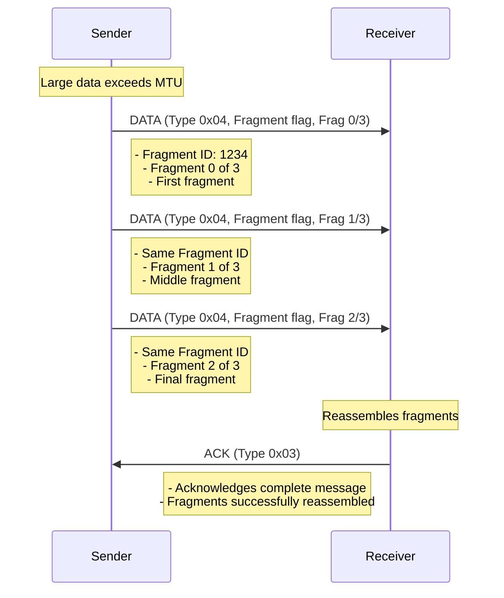
```mermaid
sequenceDiagram
    participant Sender
    participant Receiver
    
    Note over Sender: Large data exceeds MTU
    Sender->>Receiver: DATA (Type 0x04, Fragment flag, Frag 0/3)
    Note right of Sender: - Fragment ID: 1234<br/>- Fragment 0 of 3<br/>- First fragment
    
    Sender->>Receiver: DATA (Type 0x04, Fragment flag, Frag 1/3)
    Note right of Sender: - Same Fragment ID<br/>- Fragment 1 of 3<br/>- Middle fragment
    
    Sender->>Receiver: DATA (Type 0x04, Fragment flag, Frag 2/3)
    Note right of Sender: - Same Fragment ID<br/>- Fragment 2 of 3<br/>- Final fragment
    
    Note over Receiver: Reassembles fragments
    Receiver->>Sender: ACK (Type 0x03)
    Note left of Receiver: - Acknowledges complete message<br/>- Fragments successfully reassembled
```

## 3. Port Hopping and Time Synchronization

### 3.1 Normal Port Hopping Operation

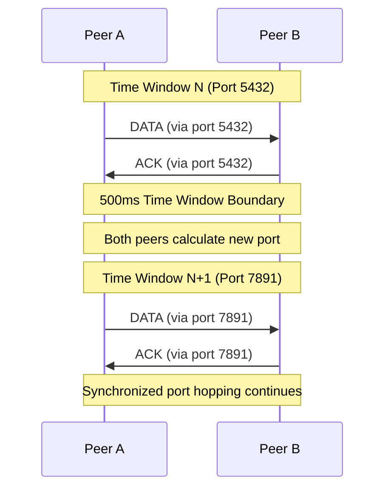
```mermaid
sequenceDiagram
    participant Peer A
    participant Peer B
    
    Note over Peer A,Peer B: Time Window N (Port 5432)
    Peer A->>Peer B: DATA (via port 5432)
    Peer B->>Peer A: ACK (via port 5432)
    
    Note over Peer A,Peer B: 500ms Time Window Boundary
    Note over Peer A,Peer B: Both peers calculate new port
    Note over Peer A,Peer B: Time Window N+1 (Port 7891)
    
    Peer A->>Peer B: DATA (via port 7891)
    Peer B->>Peer A: ACK (via port 7891)
    
    Note over Peer A,Peer B: Synchronized port hopping continues
```

### 3.2 Time Synchronization Exchange

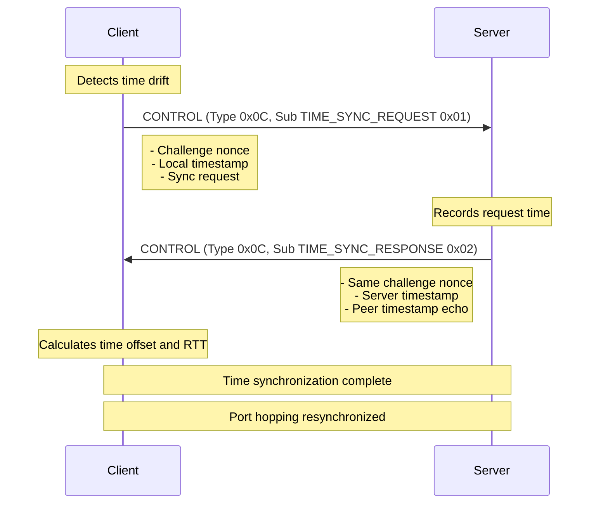
```mermaid
sequenceDiagram
    participant Client
    participant Server
    
    Note over Client: Detects time drift
    Client->>Server: CONTROL (Type 0x0C, Sub TIME_SYNC_REQUEST 0x01)
    Note right of Client: - Challenge nonce<br/>- Local timestamp<br/>- Sync request
    
    Note over Server: Records request time
    Server->>Client: CONTROL (Type 0x0C, Sub TIME_SYNC_RESPONSE 0x02)
    Note left of Server: - Same challenge nonce<br/>- Server timestamp<br/>- Peer timestamp echo
    
    Note over Client: Calculates time offset and RTT
    Note over Client,Server: Time synchronization complete
    Note over Client,Server: Port hopping resynchronized
```

## 4. Recovery Scenarios

### 4.1 Time Resynchronization Recovery

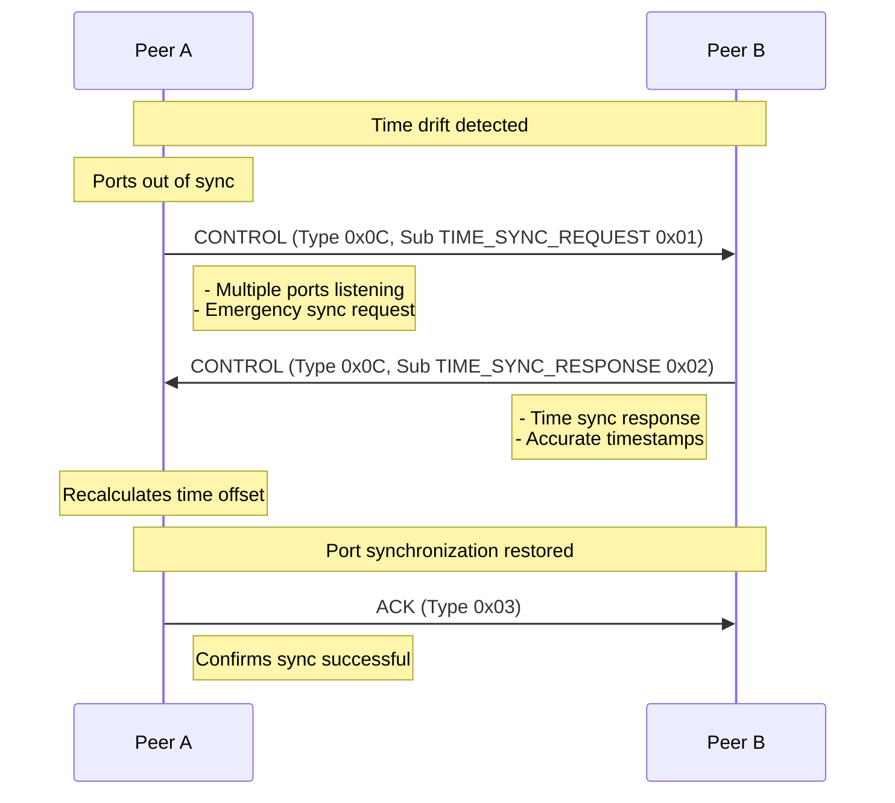
```mermaid
sequenceDiagram
    participant Peer A
    participant Peer B
    
    Note over Peer A,Peer B: Time drift detected
    Note over Peer A: Ports out of sync
    
    Peer A->>Peer B: CONTROL (Type 0x0C, Sub TIME_SYNC_REQUEST 0x01)
    Note right of Peer A: - Multiple ports listening<br/>- Emergency sync request
    
    Peer B->>Peer A: CONTROL (Type 0x0C, Sub TIME_SYNC_RESPONSE 0x02)
    Note left of Peer B: - Time sync response<br/>- Accurate timestamps
    
    Note over Peer A: Recalculates time offset
    Note over Peer A,Peer B: Port synchronization restored
    
    Peer A->>Peer B: ACK (Type 0x03)
    Note right of Peer A: Confirms sync successful
```

### 4.2 Sequence Repair Recovery

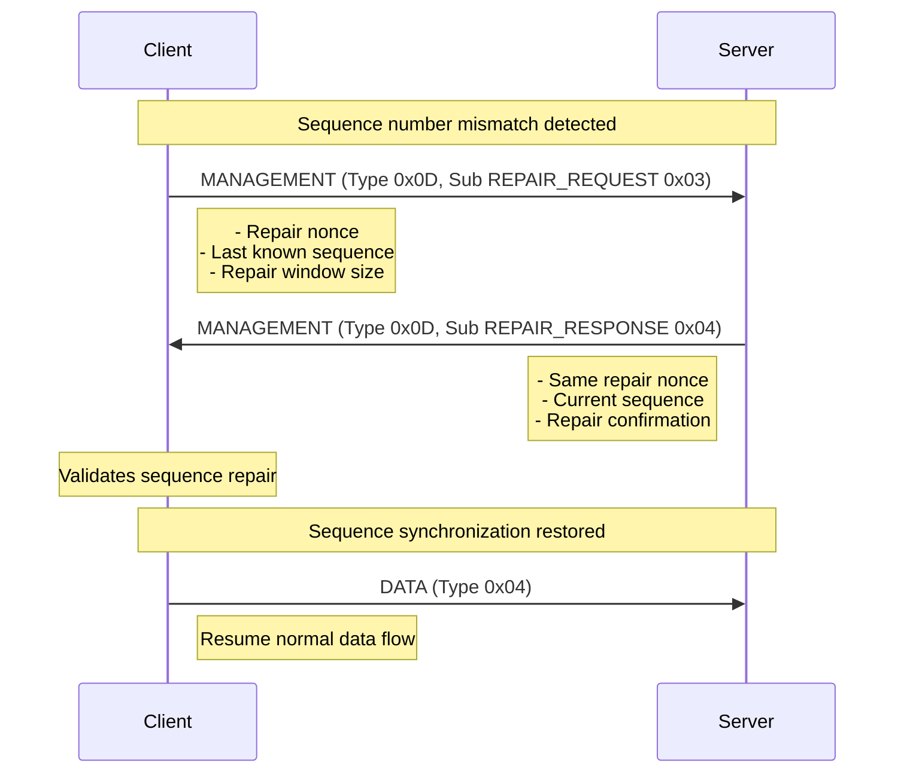
```mermaid
sequenceDiagram
    participant Client
    participant Server
    
    Note over Client,Server: Sequence number mismatch detected
    
    Client->>Server: MANAGEMENT (Type 0x0D, Sub REPAIR_REQUEST 0x03)
    Note right of Client: - Repair nonce<br/>- Last known sequence<br/>- Repair window size
    
    Server->>Client: MANAGEMENT (Type 0x0D, Sub REPAIR_RESPONSE 0x04)
    Note left of Server: - Same repair nonce<br/>- Current sequence<br/>- Repair confirmation
    
    Note over Client: Validates sequence repair
    Note over Client,Server: Sequence synchronization restored
    
    Client->>Server: DATA (Type 0x04)
    Note right of Client: Resume normal data flow
```

### 4.3 Session Rekeying

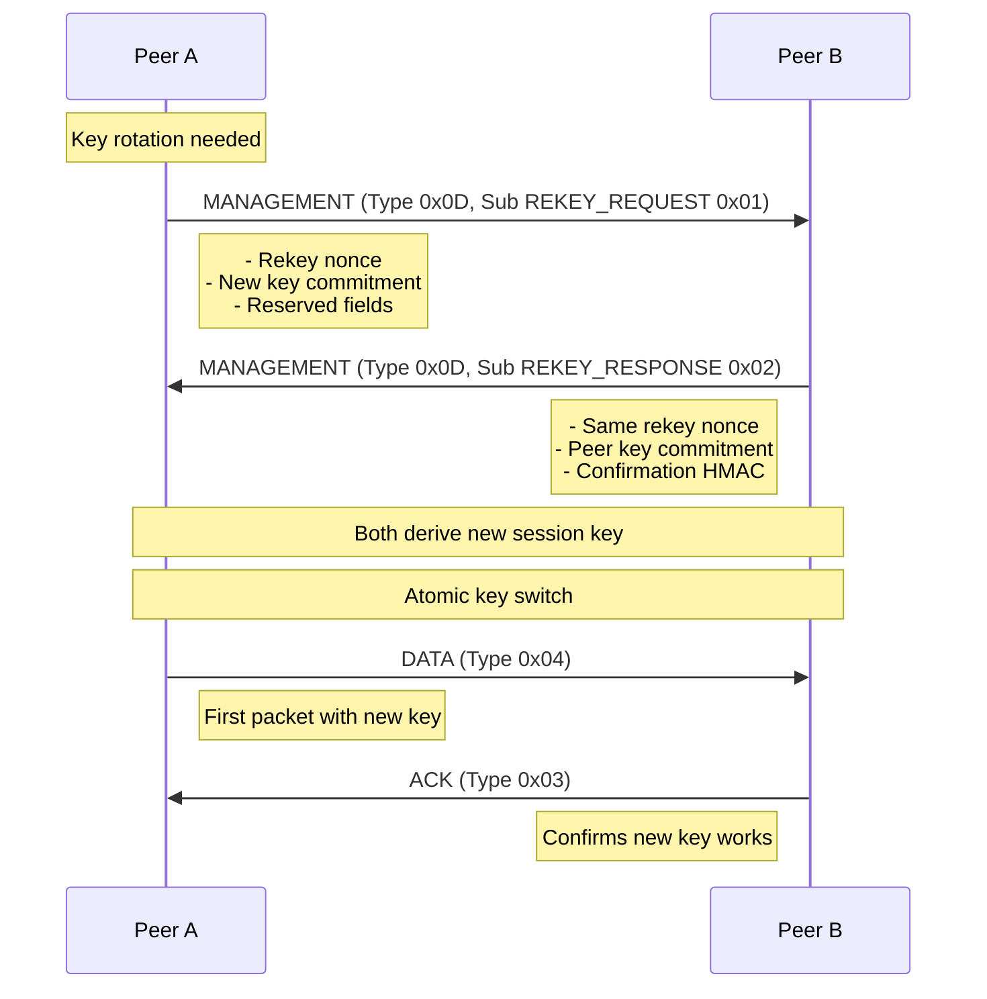
```mermaid
sequenceDiagram
    participant Peer A
    participant Peer B
    
    Note over Peer A: Key rotation needed
    
    Peer A->>Peer B: MANAGEMENT (Type 0x0D, Sub REKEY_REQUEST 0x01)
    Note right of Peer A: - Rekey nonce<br/>- New key commitment<br/>- Reserved fields
    
    Peer B->>Peer A: MANAGEMENT (Type 0x0D, Sub REKEY_RESPONSE 0x02)
    Note left of Peer B: - Same rekey nonce<br/>- Peer key commitment<br/>- Confirmation HMAC
    
    Note over Peer A,Peer B: Both derive new session key
    Note over Peer A,Peer B: Atomic key switch
    
    Peer A->>Peer B: DATA (Type 0x04)
    Note right of Peer A: First packet with new key
    
    Peer B->>Peer A: ACK (Type 0x03)
    Note left of Peer B: Confirms new key works
```

### 4.4 Connection Termination on Recovery Failure

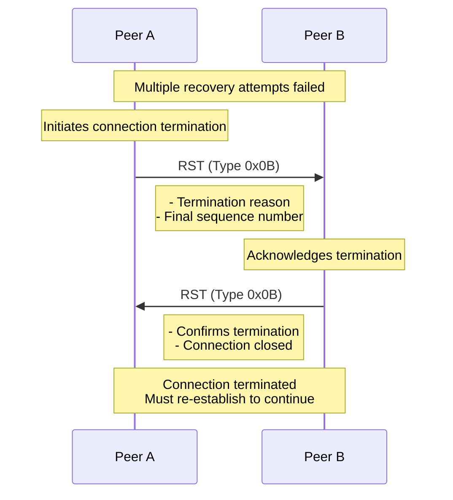
```mermaid
sequenceDiagram
    participant Peer A
    participant Peer B
    
    Note over Peer A,Peer B: Multiple recovery attempts failed
    Note over Peer A: Initiates connection termination
    
    Peer A->>Peer B: RST (Type 0x0B)
    Note right of Peer A: - Termination reason<br/>- Final sequence number
    
    Note over Peer B: Acknowledges termination
    Peer B->>Peer A: RST (Type 0x0B)
    Note left of Peer B: - Confirms termination<br/>- Connection closed
    
    Note over Peer A,Peer B: Connection terminated<br/>Must re-establish to continue
```

## 5. Connection Termination

### 5.1 Graceful Connection Termination

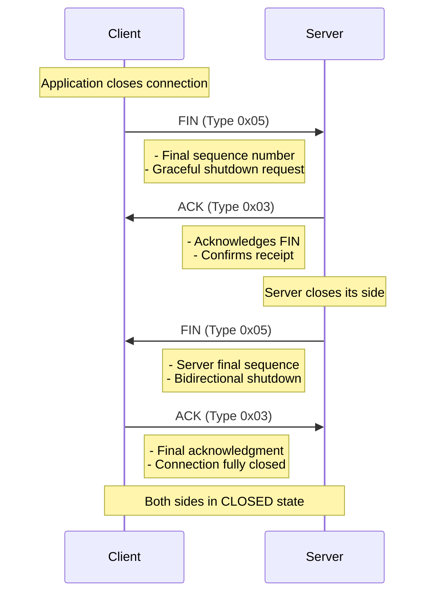
```mermaid
sequenceDiagram
    participant Client
    participant Server
    
    Note over Client: Application closes connection
    Client->>Server: FIN (Type 0x05)
    Note right of Client: - Final sequence number<br/>- Graceful shutdown request
    
    Server->>Client: ACK (Type 0x03)
    Note left of Server: - Acknowledges FIN<br/>- Confirms receipt
    
    Note over Server: Server closes its side
    Server->>Client: FIN (Type 0x05)
    Note left of Server: - Server final sequence<br/>- Bidirectional shutdown
    
    Client->>Server: ACK (Type 0x03)
    Note right of Client: - Final acknowledgment<br/>- Connection fully closed
    
    Note over Client,Server: Both sides in CLOSED state
```

### 5.2 Forceful Connection Reset

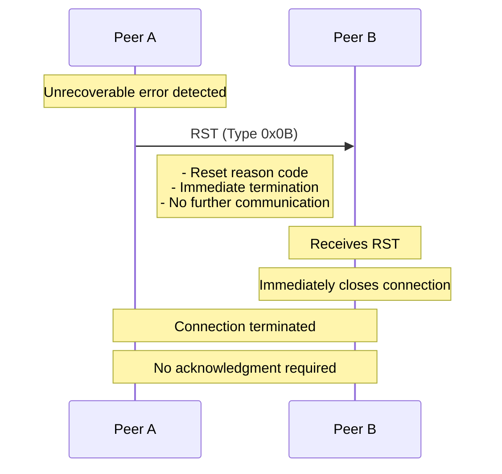
```mermaid
sequenceDiagram
    participant Peer A
    participant Peer B
    
    Note over Peer A: Unrecoverable error detected
    Peer A->>Peer B: RST (Type 0x0B)
    Note right of Peer A: - Reset reason code<br/>- Immediate termination<br/>- No further communication
    
    Note over Peer B: Receives RST
    Note over Peer B: Immediately closes connection
    Note over Peer A,Peer B: Connection terminated
    Note over Peer A,Peer B: No acknowledgment required
```

## 6. Error Handling Flows

### 6.1 Authentication Error Recovery

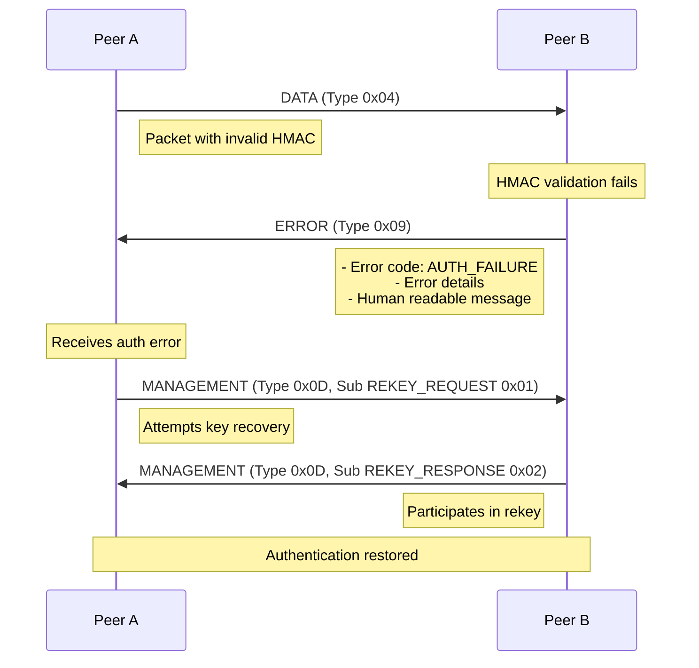
```mermaid
sequenceDiagram
    participant Peer A
    participant Peer B
    
    Peer A->>Peer B: DATA (Type 0x04)
    Note right of Peer A: Packet with invalid HMAC
    
    Note over Peer B: HMAC validation fails
    Peer B->>Peer A: ERROR (Type 0x09)
    Note left of Peer B: - Error code: AUTH_FAILURE<br/>- Error details<br/>- Human readable message
    
    Note over Peer A: Receives auth error
    Peer A->>Peer B: MANAGEMENT (Type 0x0D, Sub REKEY_REQUEST 0x01)
    Note right of Peer A: Attempts key recovery
    
    Peer B->>Peer A: MANAGEMENT (Type 0x0D, Sub REKEY_RESPONSE 0x02)
    Note left of Peer B: Participates in rekey
    
    Note over Peer A,Peer B: Authentication restored
```

### 6.2 Protocol Error with Recovery

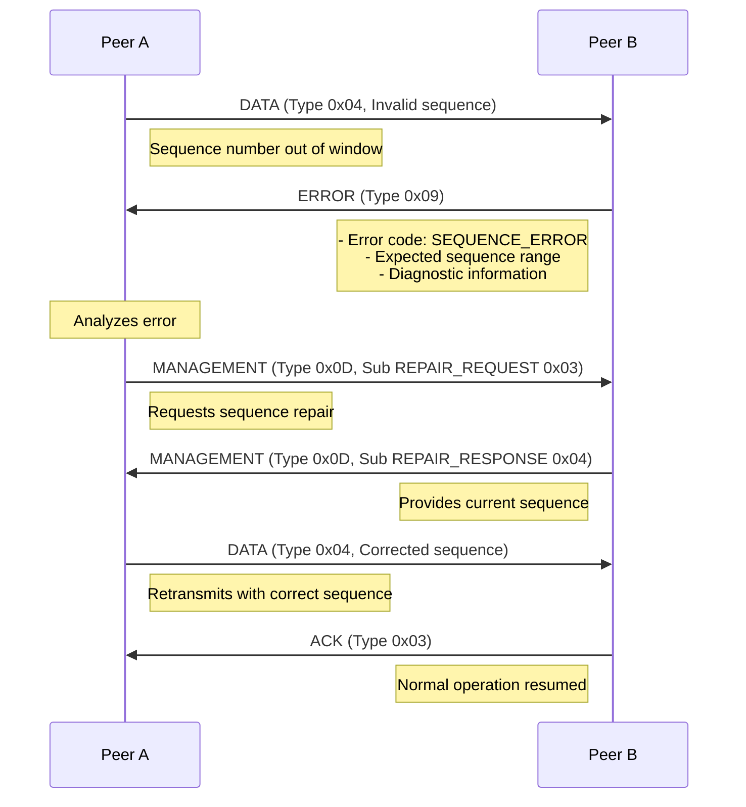
```mermaid
sequenceDiagram
    participant Peer A
    participant Peer B
    
    Peer A->>Peer B: DATA (Type 0x04, Invalid sequence)
    Note right of Peer A: Sequence number out of window
    
    Peer B->>Peer A: ERROR (Type 0x09)
    Note left of Peer B: - Error code: SEQUENCE_ERROR<br/>- Expected sequence range<br/>- Diagnostic information
    
    Note over Peer A: Analyzes error
    Peer A->>Peer B: MANAGEMENT (Type 0x0D, Sub REPAIR_REQUEST 0x03)
    Note right of Peer A: Requests sequence repair
    
    Peer B->>Peer A: MANAGEMENT (Type 0x0D, Sub REPAIR_RESPONSE 0x04)
    Note left of Peer B: Provides current sequence
    
    Peer A->>Peer B: DATA (Type 0x04, Corrected sequence)
    Note right of Peer A: Retransmits with correct sequence
    
    Peer B->>Peer A: ACK (Type 0x03)
    Note left of Peer B: Normal operation resumed
```

## 7. Heartbeat and Keep-Alive

### 7.1 Normal Heartbeat Exchange

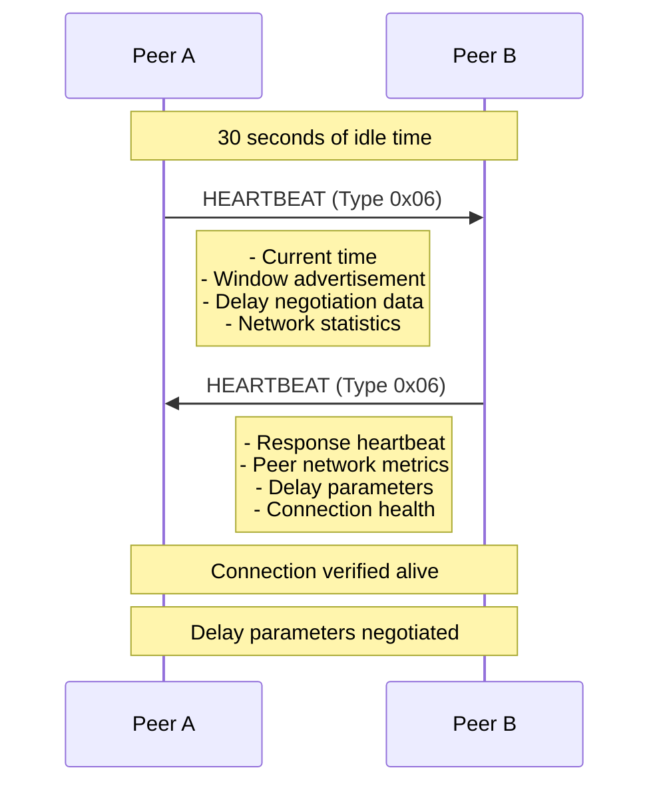
```mermaid
sequenceDiagram
    participant Peer A
    participant Peer B
    
    Note over Peer A,Peer B: 30 seconds of idle time
    
    Peer A->>Peer B: HEARTBEAT (Type 0x06)
    Note right of Peer A: - Current time<br/>- Window advertisement<br/>- Delay negotiation data<br/>- Network statistics
    
    Peer B->>Peer A: HEARTBEAT (Type 0x06)
    Note left of Peer B: - Response heartbeat<br/>- Peer network metrics<br/>- Delay parameters<br/>- Connection health
    
    Note over Peer A,Peer B: Connection verified alive
    Note over Peer A,Peer B: Delay parameters negotiated
```

### 7.2 Heartbeat Timeout and Recovery

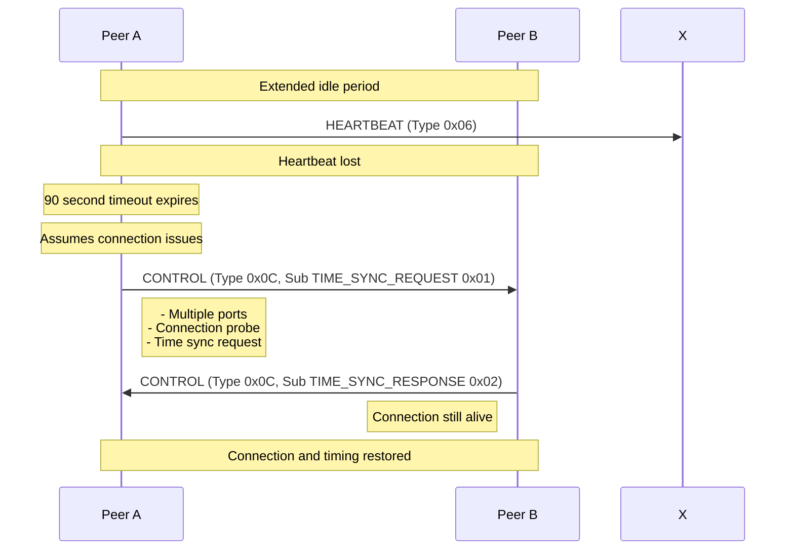
```mermaid
sequenceDiagram
    participant Peer A
    participant Peer B
    
    Note over Peer A,Peer B: Extended idle period
    
    Peer A->>X: HEARTBEAT (Type 0x06)
    Note over Peer A,Peer B: Heartbeat lost
    
    Note over Peer A: 90 second timeout expires
    Note over Peer A: Assumes connection issues
    
    Peer A->>Peer B: CONTROL (Type 0x0C, Sub TIME_SYNC_REQUEST 0x01)
    Note right of Peer A: - Multiple ports<br/>- Connection probe<br/>- Time sync request
    
    Peer B->>Peer A: CONTROL (Type 0x0C, Sub TIME_SYNC_RESPONSE 0x02)
    Note left of Peer B: Connection still alive
    
    Note over Peer A,Peer B: Connection and timing restored
```

## 8. Multiple Connection Scenarios

### 8.1 Parallel Connection Establishment

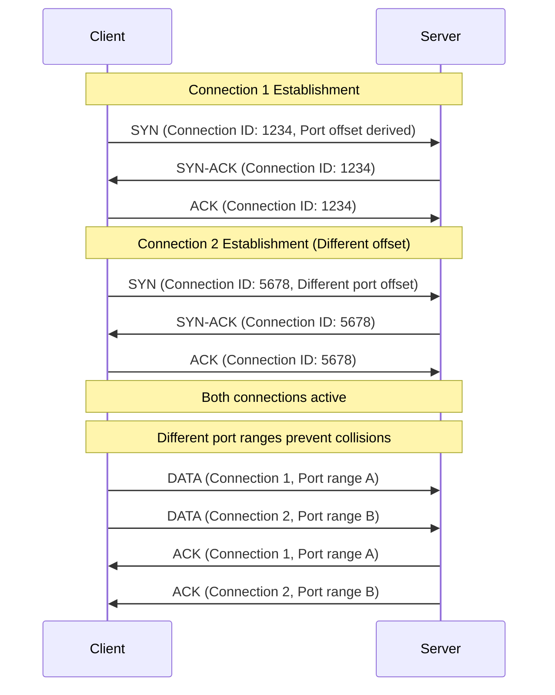
```mermaid
sequenceDiagram
    participant Client
    participant Server
    
    Note over Client,Server: Connection 1 Establishment
    Client->>Server: SYN (Connection ID: 1234, Port offset derived)
    Server->>Client: SYN-ACK (Connection ID: 1234)
    Client->>Server: ACK (Connection ID: 1234)
    
    Note over Client,Server: Connection 2 Establishment (Different offset)
    Client->>Server: SYN (Connection ID: 5678, Different port offset)
    Server->>Client: SYN-ACK (Connection ID: 5678)
    Client->>Server: ACK (Connection ID: 5678)
    
    Note over Client,Server: Both connections active
    Note over Client,Server: Different port ranges prevent collisions
    
    Client->>Server: DATA (Connection 1, Port range A)
    Client->>Server: DATA (Connection 2, Port range B)
    Server->>Client: ACK (Connection 1, Port range A)
    Server->>Client: ACK (Connection 2, Port range B)
```

## 9. Edge Cases and Complex Scenarios

### 9.1 Simultaneous Recovery Attempts

```mermaid
sequenceDiagram
    participant Peer A
    participant Peer B
    
    Note over Peer A,Peer B: Both detect issues simultaneously
    
    Peer A->>Peer B: CONTROL (Type 0x0C, Sub TIME_SYNC_REQUEST 0x01)
    Peer B->>Peer A: CONTROL (Type 0x0C, Sub TIME_SYNC_REQUEST 0x01)
    
    Note over Peer A: Receives peer's request
    Note over Peer B: Receives peer's request
    
    Note over Peer A: Lower endpoint initiates
    Peer A->>Peer B: CONTROL (Type 0x0C, Sub TIME_SYNC_RESPONSE 0x02)
    
    Note over Peer B: Higher endpoint responds
    Peer B->>Peer A: CONTROL (Type 0x0C, Sub TIME_SYNC_RESPONSE 0x02)
    
    Note over Peer A,Peer B: Recovery coordination successful
```

### 9.2 Cascading Recovery Scenario

```mermaid
sequenceDiagram
    participant Peer A
    participant Peer B
    
    Note over Peer A,Peer B: Time drift causes sequence issues
    
    Peer A->>Peer B: CONTROL (Type 0x0C, Sub TIME_SYNC_REQUEST 0x01)
    Peer B->>Peer A: CONTROL (Type 0x0C, Sub TIME_SYNC_RESPONSE 0x02)
    
    Note over Peer A,Peer B: Time sync successful
    
    Peer A->>Peer B: DATA (Type 0x04)
    Note right of Peer A: Still has sequence issues
    
    Peer B->>Peer A: ERROR (Type 0x09)
    Note left of Peer B: Sequence still wrong
    
    Peer A->>Peer B: MANAGEMENT (Type 0x0D, Sub REPAIR_REQUEST 0x03)
    Peer B->>Peer A: MANAGEMENT (Type 0x0D, Sub REPAIR_RESPONSE 0x04)
    
    Note over Peer A,Peer B: Full recovery complete
    
    Peer A->>Peer B: DATA (Type 0x04)
    Peer B->>Peer A: ACK (Type 0x03)
    
    Note over Peer A,Peer B: Normal operation restored
```

## 10. PSK Discovery Failure Scenarios

### 10.1 PSK Discovery Timeout and Retry

```mermaid
sequenceDiagram
    participant Client
    participant Server
    
    Note over Client,Server: Initial Discovery Attempt
    Client->>Server: DISCOVERY_REQUEST (Type 0x0E, Sub 0x01)
    
    Note over Client: 10 second timeout expires
    Note over Client: No response received
    
    Note over Client: Retry 1 with exponential backoff
    Client->>Server: DISCOVERY_REQUEST (Type 0x0E, Sub 0x01)
    Note right of Client: - Same discovery ID<br/>- Increased timeout<br/>- Retry attempt flag
    
    Server->>Client: DISCOVERY_RESPONSE (Type 0x0E, Sub 0x02)
    Note left of Server: - Response with PSK commitments<br/>- Valid response
    
    Client->>Server: DISCOVERY_CONFIRM (Type 0x0E, Sub 0x03)
    Note right of Client: - Successful PSK selection<br/>- Proceed to handshake
    
    Note over Client,Server: Recovery successful after retry
```

### 10.2 PSK Discovery No Common Key Found

```mermaid
sequenceDiagram
    participant Client
    participant Server
    
    Client->>Server: DISCOVERY_REQUEST (Type 0x0E, Sub 0x01)
    Note right of Client: - Discovery ID<br/>- Client PSK commitments<br/>- Challenge nonce
    
    Server->>Client: DISCOVERY_RESPONSE (Type 0x0E, Sub 0x02)
    Note left of Server: - Empty PSK commitment list<br/>- No matching PSKs found<br/>- Error indication
    
    Note over Client: No compatible PSKs
    Client->>Server: ERROR (Type 0x09)
    Note right of Client: - Error: NO_COMMON_PSK<br/>- Connection terminated<br/>- No further attempts
    
    Note over Client,Server: Connection establishment failed
```

### 10.3 PSK Enumeration Attack Detection

```mermaid
sequenceDiagram
    participant Attacker
    participant Server
    
    Note over Attacker: Multiple rapid discovery attempts
    
    Attacker->>Server: DISCOVERY_REQUEST (Type 0x0E, Sub 0x01)
    Note right of Attacker: Attempt 1: Invalid PSK probe
    
    Attacker->>Server: DISCOVERY_REQUEST (Type 0x0E, Sub 0x01)
    Note right of Attacker: Attempt 2: Different PSK probe
    
    Attacker->>Server: DISCOVERY_REQUEST (Type 0x0E, Sub 0x01)
    Note right of Attacker: Attempt 3: Another PSK probe
    
    Note over Server: Detects enumeration pattern
    Note over Server: Rate limiting triggered
    
    Server->>Attacker: ERROR (Type 0x09)
    Note left of Server: - Error: RATE_LIMITED<br/>- 5 minute block duration<br/>- No further responses
    
    Note over Server: IP blocked for enumeration
```

## 11. Complete Recovery Escalation Chain

### 11.1 Full Recovery Escalation Sequence

```mermaid
sequenceDiagram
    participant Peer A
    participant Peer B
    
    Note over Peer A,Peer B: Initial problem detected
    
    Note over Peer A,Peer B: Stage 1: Time Resynchronization
    Peer A->>Peer B: CONTROL (Type 0x0C, Sub TIME_SYNC_REQUEST 0x01)
    Peer B->>Peer A: CONTROL (Type 0x0C, Sub TIME_SYNC_RESPONSE 0x02)
    
    Note over Peer A: Time sync failed
    Note over Peer A: Escalate to Stage 2
    
    Note over Peer A,Peer B: Stage 2: Sequence Repair
    Peer A->>Peer B: MANAGEMENT (Type 0x0D, Sub REPAIR_REQUEST 0x03)
    Peer B->>Peer A: ERROR (Type 0x09)
    Note left of Peer B: Sequence repair failed
    
    Note over Peer A: Sequence repair failed
    Note over Peer A: Escalate to Stage 3
    
    Note over Peer A,Peer B: Stage 3: Session Rekeying
    Peer A->>Peer B: MANAGEMENT (Type 0x0D, Sub REKEY_REQUEST 0x01)
    Peer B->>Peer A: MANAGEMENT (Type 0x0D, Sub REKEY_RESPONSE 0x02)
    
    Note over Peer A: Rekey validation failed
    Note over Peer A: Escalate to Stage 4
    
    Note over Peer A,Peer B: Stage 4: Emergency Recovery
    Peer A->>Peer B: CONTROL (Type 0x0C, Sub EMERGENCY_REQUEST 0x04)
    Peer B->>Peer A: CONTROL (Type 0x0C, Sub EMERGENCY_RESPONSE 0x05)
    
    Peer A->>Peer B: CONTROL (Type 0x0C, Sub EMERGENCY_VERIFY 0x07)
    Peer B->>Peer A: ACK (Type 0x03)
    
    Note over Peer A,Peer B: Emergency recovery successful
    Note over Peer A,Peer B: Session fully restored
```

### 11.2 Recovery Attempt Exhaustion

```mermaid
sequenceDiagram
    participant Peer A
    participant Peer B
    
    Note over Peer A: Maximum recovery attempts reached
    Note over Peer A: All recovery types have failed
    
    Peer A->>Peer B: RST (Type 0x0B)
    Note right of Peer A: - Reset reason: RECOVERY_EXHAUSTED<br/>- Immediate termination<br/>- Session unrecoverable
    
    Note over Peer B: Receives RST
    Note over Peer B: Clears session state
    
    Note over Peer A,Peer B: Session terminated
    Note over Peer A,Peer B: New connection required
```

## 12. Advanced Fragmentation Scenarios

### 12.1 Fragment Timeout and Retransmission

```mermaid
sequenceDiagram
    participant Sender
    participant Receiver
    
    Sender->>Receiver: DATA (Fragment 0/3, ID 1234)
    Sender->>X: DATA (Fragment 1/3, ID 1234)
    Note over Sender,Receiver: Fragment 1 lost
    Sender->>Receiver: DATA (Fragment 2/3, ID 1234)
    
    Note over Receiver: 30 second timeout expires
    Note over Receiver: Fragment 1 missing
    
    Receiver->>Sender: ERROR (Type 0x09)
    Note left of Receiver: - Error: FRAGMENT_TIMEOUT<br/>- Fragment ID: 1234<br/>- Missing fragment bitmap
    
    Note over Sender: Retransmit missing fragment
    Sender->>Receiver: DATA (Fragment 1/3, ID 1234)
    Note right of Sender: Retransmission of lost fragment
    
    Note over Receiver: All fragments received
    Note over Receiver: Reassembly complete
    
    Receiver->>Sender: ACK (Type 0x03)
    Note left of Receiver: Acknowledges complete message
```

### 12.2 Fragment Overlap Attack Detection

```mermaid
sequenceDiagram
    participant Attacker
    participant Victim
    
    Attacker->>Victim: DATA (Fragment 0/3, ID 5678, Offset 0-500)
    Note right of Attacker: Normal first fragment
    
    Attacker->>Victim: DATA (Fragment 1/3, ID 5678, Offset 400-900)
    Note right of Attacker: Overlapping fragment attack
    
    Note over Victim: Detects overlap
    Note over Victim: Offset 400-500 overlap detected
    
    Victim->>Attacker: ERROR (Type 0x09)
    Note left of Victim: - Error: FRAGMENT_OVERLAP<br/>- Attack detected<br/>- Fragment discarded
    
    Note over Victim: Drops entire fragment set
    Note over Victim: Security violation logged
```

## 13. Flow Control Edge Cases

### 13.1 Zero Window Probing

```mermaid
sequenceDiagram
    participant Sender
    participant Receiver
    
    Note over Receiver: Receive buffer full
    
    Receiver->>Sender: ACK (Type 0x03, Window=0)
    Note left of Receiver: - Zero window advertisement<br/>- Flow control stop
    
    Note over Sender: Window closed
    Note over Sender: Stop data transmission
    
    Note over Sender: 5 second probe timer expires
    Sender->>Receiver: DATA (Type 0x04, 1 byte probe)
    Note right of Sender: - Zero window probe<br/>- Single byte payload<br/>- Tests receiver readiness
    
    Receiver->>Sender: ACK (Type 0x03, Window=0)
    Note left of Receiver: Still no buffer space
    
    Note over Sender: Continue probing every 5 seconds
    
    Note over Receiver: Application reads data
    Note over Receiver: Buffer space available
    
    Receiver->>Sender: ACK (Type 0x03, Window=8192)
    Note left of Receiver: - Window opened<br/>- Buffer space available
    
    Sender->>Receiver: DATA (Type 0x04)
    Note right of Sender: Resume normal transmission
```

### 13.2 Flow Control Deadlock Resolution

```mermaid
sequenceDiagram
    participant Peer A
    participant Peer B
    
    Note over Peer A,Peer B: Both sides have zero windows
    
    Peer A->>Peer B: ACK (Type 0x03, Window=0)
    Peer B->>Peer A: ACK (Type 0x03, Window=0)
    
    Note over Peer A,Peer B: Deadlock detected
    
    Note over Peer A: Forced window update
    Peer A->>Peer B: ACK (Type 0x03, Window=1024)
    Note right of Peer A: - Emergency window opening<br/>- Minimum viable window<br/>- Deadlock prevention
    
    Peer B->>Peer A: DATA (Type 0x04, Small payload)
    Note left of Peer B: Sends minimum data
    
    Note over Peer A: Processes data
    Note over Peer A: Frees buffer space
    
    Peer A->>Peer B: ACK (Type 0x03, Window=4096)
    Note right of Peer A: Normal window advertisement
    
    Note over Peer A,Peer B: Flow control restored
```

## 14. Multi-Connection Collision Resolution

### 14.1 Connection Port Collision Detection

```mermaid
sequenceDiagram
    participant Client
    participant Server
    
    Note over Client,Server: Connection 1 established (ports 5000-5999)
    
    Note over Client: Start Connection 2
    Client->>Server: SYN (Connection 2, calculated port 5234)
    Note right of Client: - Port collision with Connection 1<br/>- Same derived port range
    
    Note over Server: Detects port collision
    Server->>Client: ERROR (Type 0x09)
    Note left of Server: - Error: PORT_COLLISION<br/>- Suggests offset adjustment<br/>- Collision resolution needed
    
    Note over Client: Recalculate with new offset
    Note over Client: Apply collision resolution offset
    
    Client->>Server: SYN (Connection 2, adjusted port 7234)
    Note right of Client: - New port range (7000-7999)<br/>- Collision avoided<br/>- Unique offset applied
    
    Server->>Client: SYN-ACK (Connection 2)
    Client->>Server: ACK (Connection 2)
    
    Note over Client,Server: Both connections active
    Note over Client,Server: No port collisions
```

### 14.2 Session ID Collision Resolution

```mermaid
sequenceDiagram
    participant Client
    participant Server
    
    Client->>Server: SYN (Session ID: 0x123456789ABCDEF0)
    Note right of Client: New connection attempt
    
    Note over Server: Session ID already exists
    Note over Server: Active connection using same ID
    
    Server->>Client: ERROR (Type 0x09)
    Note left of Server: - Error: SESSION_ID_COLLISION<br/>- Existing session detected<br/>- New ID required
    
    Note over Client: Generate new session ID
    Note over Client: Add randomization salt
    
    Client->>Server: SYN (Session ID: 0x987654321FEDCBA0)
    Note right of Client: - Different session ID<br/>- Collision resolved<br/>- Unique session
    
    Server->>Client: SYN-ACK
    Client->>Server: ACK
    
    Note over Client,Server: New session established
    Note over Client,Server: No ID conflicts
```

## 15. Advanced Security Scenarios

### 15.1 Authentication Failure Cascade

```mermaid
sequenceDiagram
    participant Peer A
    participant Peer B
    
    Peer A->>Peer B: DATA (Type 0x04, Invalid HMAC)
    Note right of Peer A: Authentication failure 1
    
    Note over Peer B: HMAC verification fails
    Peer B->>Peer A: ERROR (Type 0x09)
    Note left of Peer B: - Error: AUTH_FAILURE<br/>- HMAC mismatch<br/>- Failure count: 1
    
    Peer A->>Peer B: DATA (Type 0x04, Invalid HMAC)
    Note right of Peer A: Authentication failure 2
    
    Peer B->>Peer A: ERROR (Type 0x09)
    Note left of Peer B: - Error: AUTH_FAILURE<br/>- Failure count: 2<br/>- Warning threshold
    
    Peer A->>Peer B: DATA (Type 0x04, Invalid HMAC)
    Note right of Peer A: Authentication failure 3
    
    Note over Peer B: Threshold exceeded
    Note over Peer B: Trigger automatic rekey
    
    Peer B->>Peer A: MANAGEMENT (Type 0x0D, Sub REKEY_REQUEST 0x01)
    Note left of Peer B: - Automatic rekey triggered<br/>- Security threshold exceeded<br/>- Key compromise suspected
    
    Peer A->>Peer B: MANAGEMENT (Type 0x0D, Sub REKEY_RESPONSE 0x02)
    
    Note over Peer A,Peer B: New session key established
    
    Peer A->>Peer B: DATA (Type 0x04, Valid HMAC)
    Peer B->>Peer A: ACK (Type 0x03)
    
    Note over Peer A,Peer B: Authentication restored
```

### 15.2 Replay Attack Detection and Prevention

```mermaid
sequenceDiagram
    participant Attacker
    participant Victim
    
    Note over Attacker: Captures valid packet
    
    Victim->>Attacker: DATA (Type 0x04, Timestamp T1, Seq 100)
    Note left of Victim: Original valid packet
    
    Note over Attacker: Replays captured packet
    Attacker->>Victim: DATA (Type 0x04, Timestamp T1, Seq 100)
    Note right of Attacker: - Same timestamp T1<br/>- Same sequence 100<br/>- Replay attempt
    
    Note over Victim: Detects replay
    Note over Victim: - Timestamp T1 outside window<br/>- Sequence 100 already seen<br/>- Anti-replay triggered
    
    Victim->>Attacker: ERROR (Type 0x09)
    Note left of Victim: - Error: REPLAY_DETECTED<br/>- Packet discarded<br/>- Security violation logged
    
    Note over Victim: Increases replay threshold
    Note over Victim: Strengthens timestamp validation
```

## 16. Network Adaptation Scenarios

### 16.1 MTU Discovery and Dynamic Fragmentation

```mermaid
sequenceDiagram
    participant Sender
    participant Network
    participant Receiver
    
    Note over Sender: Large message (2000 bytes)
    Note over Sender: Assume MTU 1500
    
    Sender->>Network: DATA (1400 bytes, no fragment flag)
    Note right of Sender: Single packet attempt
    
    Network->>Sender: ICMP Fragmentation Needed (MTU 1200)
    Note over Network: Path MTU smaller than expected
    
    Note over Sender: Update MTU to 1200
    Note over Sender: Enable fragmentation
    
    Sender->>Receiver: DATA (Fragment 0/2, 1100 bytes)
    Sender->>Receiver: DATA (Fragment 1/2, 900 bytes)
    
    Note over Receiver: Reassemble fragments
    Receiver->>Sender: ACK (Type 0x03)
    
    Note over Sender,Receiver: Adaptive fragmentation established
```

### 16.2 Delay Parameter Negotiation

```mermaid
sequenceDiagram
    participant Peer A
    participant Peer B
    
    Note over Peer A,Peer B: Network conditions changing
    
    Peer A->>Peer B: HEARTBEAT (Type 0x06)
    Note right of Peer A: - Current delay window: 4<br/>- Measured jitter: 150ms<br/>- Loss rate: 2%<br/>- Propose window: 6
    
    Peer B->>Peer A: HEARTBEAT (Type 0x06)
    Note left of Peer B: - Current delay window: 4<br/>- Measured jitter: 200ms<br/>- Loss rate: 3%<br/>- Agree window: 6
    
    Note over Peer A,Peer B: Both agree on window size 6
    Note over Peer A,Peer B: Apply new delay parameters
    
    Note over Peer A,Peer B: Continue monitoring performance
    
    Peer A->>Peer B: HEARTBEAT (Type 0x06)
    Note right of Peer A: - Window 6 performance good<br/>- Jitter reduced: 100ms<br/>- Loss rate: 1%<br/>- Maintain current settings
    
    Note over Peer A,Peer B: Optimal delay parameters achieved
```

## Summary

These comprehensive sequence diagrams illustrate the complete range of protocol operations from basic connection establishment through complex recovery scenarios, security attacks, and edge cases. The diagrams cover 16 major categories of protocol behavior:

### **Core Protocol Operations:**
1. **Connection Establishment** - Three-way handshakes, PSK discovery, and sequence negotiation using optimized 50-byte headers
2. **Data Transmission** - Normal flow control, SACK-based loss recovery, and fragmentation for large messages
3. **Port Hopping and Time Sync** - Coordinated port changes and precise time synchronization between peers
4. **Connection Termination** - Graceful FIN-based shutdown and forceful RST-based termination

### **Recovery and Error Handling:**
5. **Recovery Scenarios** - Time resync, sequence repair, session rekeying, and connection termination on failure
6. **Error Handling** - Authentication failures, protocol errors, and systematic recovery responses
7. **Complete Recovery Escalation** - Full chain from time sync through connection termination, including failure scenarios

### **Advanced Protocol Features:**
8. **PSK Discovery Failures** - Timeout handling, enumeration attack detection, and no-common-key scenarios
9. **Advanced Fragmentation** - Timeout retransmission, overlap attack detection, and fragment bomb protection
10. **Flow Control Edge Cases** - Zero window probing and deadlock resolution mechanisms
11. **Multi-Connection Management** - Port collision resolution and session ID conflict handling
12. **Heartbeat and Keep-Alive** - Connection monitoring, timeout detection, and liveness verification

### **Security and Attack Scenarios:**
13. **Advanced Security** - Authentication failure cascades, replay attack detection, and automatic rekeying
14. **Network Adaptation** - MTU discovery, dynamic fragmentation, and delay parameter negotiation

### **Key Protocol Patterns:**
- **Cryptographic validation** at each step using HMAC_SHA256_128 authentication for message integrity
- **Graceful degradation** with systematic recovery escalation through CONTROL and MANAGEMENT sub-types
- **Time-synchronized operations** for coordinated port hopping with precise timing requirements
- **Error detection and recovery** with appropriate escalation through structured packet types and sub-types
- **Security resilience** against enumeration, replay, overlap, and authentication attacks
- **Resource management** including flow control, fragmentation, and collision avoidance
- **Network adaptation** with dynamic parameter adjustment based on measured conditions
- **Parallel connection support** with cryptographic separation and collision resolution

The diagrams demonstrate both optimal operation paths and comprehensive error handling, showing how the protocol maintains security, reliability, and performance in diverse network environments and attack scenarios. All flows use the optimized packet format with consolidated sub-type architecture for maximum efficiency while providing extensive functionality through the systematic use of CONTROL, MANAGEMENT, and DISCOVERY packet types.

